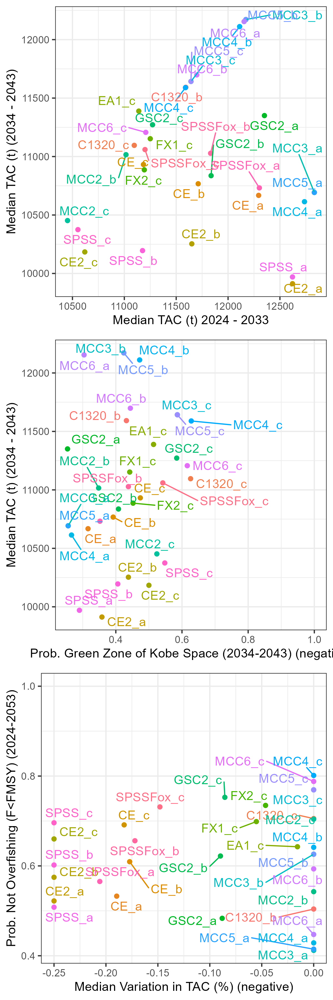
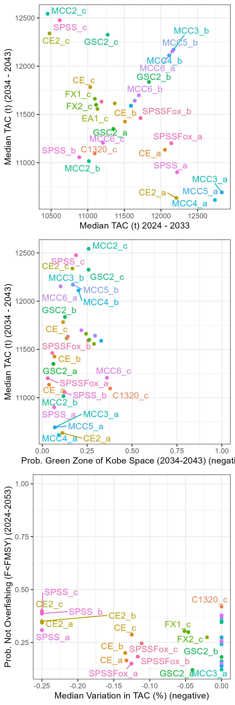
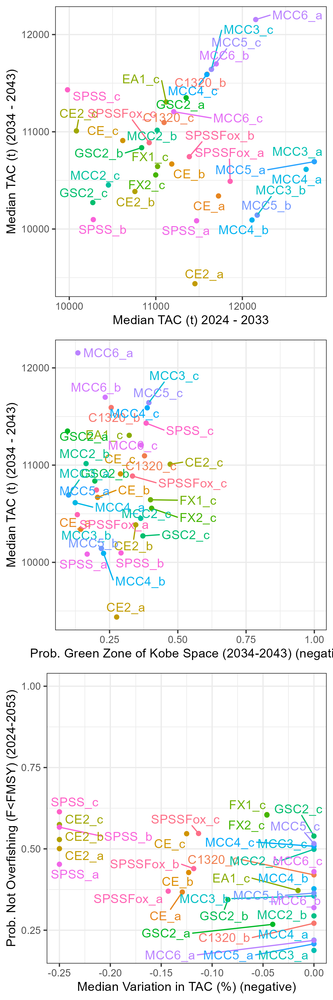
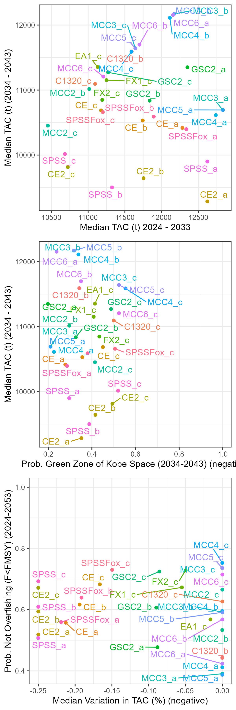
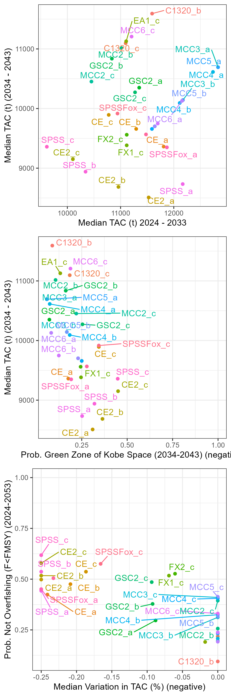

```{r setup, include=FALSE}
knitr::opts_chunk$set(echo = FALSE)
library(ggplot2)
library(dplyr)
library(SWOMSE)
```

```{r}
img_files <- list.files('../../img/MP_Reports')
MPs <- unlist(lapply(strsplit(img_files, '_'),'[[',1)) 
Rs <- unlist(lapply(strsplit(img_files, '_'),'[[',2)) 
Rs <- unlist(strsplit(Rs, '.png'))
df <- data.frame(MP=MPs, R=Rs, file=img_files)

all_MPs <- unique(df$MP)
```

## Tuning Codes

```{r}
knitr::kable(SWOMSE::TuneTargets)
```

## Reference and Robustness Operating Models 

```{r OM-Description}
OM.root <- 'G:/My Drive/1_Projects/North_Atlantic_Swordfish/OMs'
OMgrid.dir <- file.path(OM.root,'grid_2022')
OM_desc <- read.csv(file.path(OMgrid.dir, 'OM_Description.csv'))
# OM_desc$OM.objects <- NA

OM_desc$Class <- factor(OM_desc$Class, levels=unique(OM_desc$Class), ordered = TRUE)

caption <- 'Summary of the Base Case, Reference, and Robustness Operating Models.'

OM_desc$Description <- gsub("%", ' percent', OM_desc$Description)
# OM_desc$Class <- gsub("-", ' ', OM_desc$Class)
# OM_desc$Purpose <- gsub("-", ' ', OM_desc$Purpose)


OM_desc %>% knitr::kable(escape = F,
                    caption=caption,
                    booktabs=TRUE) %>%
  kableExtra::kable_styling("striped", full_width = T)

```

See [here](https://iccat.github.io/nswo-mse/TS/Trial_Specs.html#operating-models) for more details on the operating models 

## CMP Development Reports {.tabset}
```{r, results='asis'}
for (mp in all_MPs) {
  
  cat('###', mp, '{.tabset}', '\n')
  
  cat('####', 'Reference', '\n')
 
  df2 <- df %>% dplyr::filter(MP==mp, R=='Reference')
  
  cat(paste0(", ')'), "\n")
  cat('\n')
  df2 <- df %>% filter(MP==mp, R!='Reference')
  
  for (r in df2$R) {
    cat('####', r, '\n')
    df3 <- df %>% filter(MP==mp, R==r)
    cat(paste0(", ')'), "\n")
    cat('\n')
  }
  
  cat('\n')
}

```

## Quilt Plots {.tabset}

```{r, results='asis'}
Quilt <- function(PM_results, PMs=NULL) {
  library(DT)
  PM_results$Value <- round(PM_results$Value,2)
  tab <- PM_results %>% select(PM, MP, Value) %>% filter(PM %in% PMs)
  
  tab$PM <- factor(tab$PM, levels=PMs, ordered = TRUE)
  tab <- tab %>% group_by(PM) %>% arrange()
  tab <- tab  %>%
    tidyr::pivot_wider(., names_from = PM, values_from = Value)
  
  
  colfunc <- colorRampPalette(c("blue", "white"), alpha=TRUE)
  
  # Probability colors
  probs <- seq(0, 1.01, length.out=50)
  prob_colors <- rev(colfunc(length(probs)+1))
  rev_prob_colors <- rev(prob_colors)
  
  # TAC colors
  TAC_PMs <- PM_results$Name[grepl('TAC', PM_results$Name )] %>% unique()
  
  
  # Variability colors
  
  
  # Make table
  quilt <-  DT::datatable(tab, options = list(dom = 't', pageLength =50))
  
  for (i in 2:ncol(tab)) {
    pm <- colnames(tab)[i]
    
    if (grepl('TAC', pm)) {
      cuts <- seq(min(tab[,i]), max(tab[,i])*1.1, length.out=10)
      values <- rev(colfunc(length(cuts)+1))
      
    } else if (grepl('VarC', pm)) {
      # variability
      cuts <- seq(0, 1, length.out=10)
      values <- (colfunc(length(cuts)+1))
      
    } else {
      # probabilities
      cuts <- seq(0, 1.01, length.out=50)
      values <- rev(colfunc(length(cuts)+1))
    }
    quilt <- quilt %>%
      formatStyle(
        pm,
        backgroundColor = styleInterval(cuts=cuts,
                                        values=values)
        
      )
    
  }
  quilt
}

fls <- list.files('../../Results/Final_MP_Results')
cat('###', 'Reference ', '\n')
df <- readRDS(file.path('../../Results/Final_MP_Results/Reference.rdata'))
Quilt(df, PMs=c('TAC1', 'AvTAC_short', 'AvTAC_med', 'PGK_med', 'PNOF', 'VarC'))

cat('###', 'R0', '\n')
df <- readRDS(file.path('../../Results/Final_MP_Results/R0.rdata'))
Quilt(df, PMs=c('TAC1', 'AvTAC_short', 'AvTAC_med', 'PGK_med', 'PNOF', 'VarC'))

cat('###', 'R1', '\n')
df <- readRDS(file.path('../../Results/Final_MP_Results/R1.rdata'))
Quilt(df, PMs=c('TAC1', 'AvTAC_short', 'AvTAC_med', 'PGK_med', 'PNOF', 'VarC'))

cat('###', 'R2', '\n')
df <- readRDS(file.path('../../Results/Final_MP_Results/R2.rdata'))
Quilt(df, PMs=c('TAC1', 'AvTAC_short', 'AvTAC_med', 'PGK_med', 'PNOF', 'VarC'))

cat('###', 'R3', '\n')
df <- readRDS(file.path('../../Results/Final_MP_Results/R3.rdata'))
Quilt(df, PMs=c('TAC1', 'AvTAC_short', 'AvTAC_med', 'PGK_med', 'PNOF', 'VarC'))

cat('###', 'R4', '\n')
df <- readRDS(file.path('../../Results/Final_MP_Results/R4.rdata'))
Quilt(df, PMs=c('TAC1', 'AvTAC_short', 'AvTAC_med', 'PGK_med', 'PNOF', 'VarC'))


```


## Trade-Off Plots {.tabset}

### Reference

```{r}
knitr::include_graphics('../../img/TradeOffs/Reference.png')
```

### R0

```{r}

```


### R1

```{r}

```

### R2

```{r}

```

### R3

```{r}

```


### R4

```{r}

```


