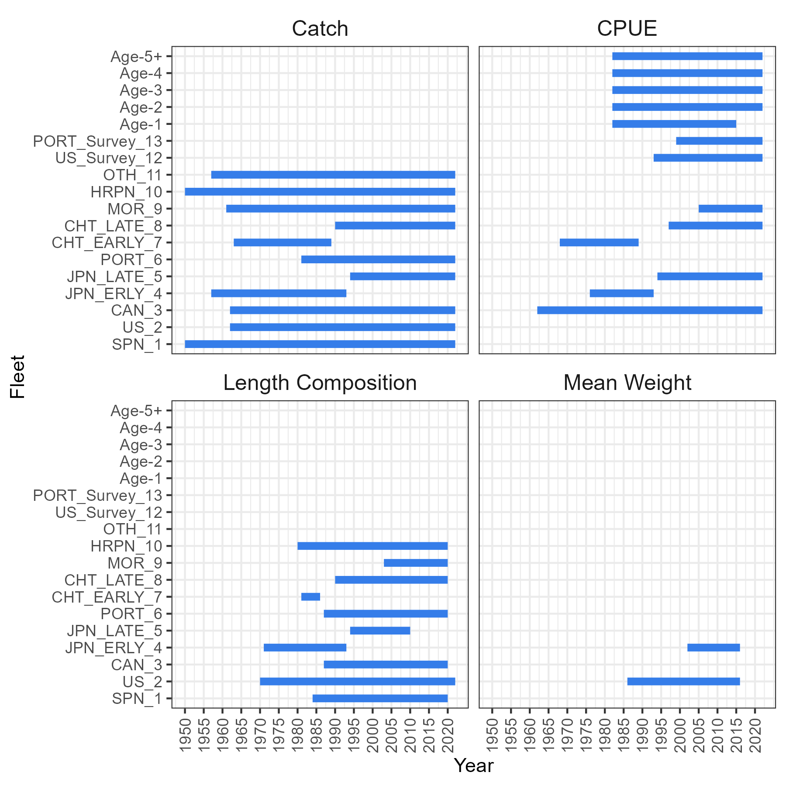

```{r setup, include=FALSE}
library(dplyr)
library(SWOMSE)
library(ggplot2)

OM.root <- 'G:/My Drive/1_Projects/North_Atlantic_Swordfish/OMs'
source('OM_Diagnostics.R')

knitr::opts_chunk$set(echo = FALSE)
options(table_counter = TRUE)

fig.num <- tab.num <- 0

fig.cap <- function() {
  fig.num <<- fig.num +1
  paste0('Figure ',  fig.num, '.')

}

tab.cap <- function() {
  tab.num <<- tab.num +1
  paste0('Table ',  tab.num, '.')
}

om.num <- params$om.num
OM.n <- as.numeric(om.num)+1 # base case is element 1 in all lists

OM_DF <- SWOMSE::OM_DF

OM_grid_DF <- SWOMSE::OM_DF %>% 
  dplyr::filter(dir!='000_base_case') %>%
  dplyr::select(-OM.num, -dir)

OM_grid_DF <- SWOMSE::OM_DF %>%
  dplyr::filter(dir!='000_base_case') %>%
  dplyr::select(-OM.num, -dir)

grid_factors_levels <- apply(OM_grid_DF, 2, unique)
grid_factors_levels <- lapply(grid_factors_levels, as.numeric)
grid_factors_levels$env <- as.logical(grid_factors_levels$env)

n_factors <- length(grid_factors_levels)
max_n_levels <- lapply(grid_factors_levels, length) %>% unlist() %>% max()

for (i in 1:n_factors) {
  temp <- grid_factors_levels[[i]]
  if (length(temp)<max_n_levels) {
    temp <- c(temp, rep(NA, max_n_levels-length(temp)))
  }
  grid_factors_levels[[i]] <- temp
}

grid_summary_DF <- as.data.frame(grid_factors_levels)
grid_summary_DF[is.na(grid_summary_DF)] <- ''
```

```{r, results='asis'}

if (om.num != '000') {
  cat('\n# Operating Model Scenario\n')
  cap.num <- tab.cap()
  cat('\n', cap.num, 'The uncertainty grid is a full factorial design with the following ', n_factors, ' factors, resulting in', nrow(OM_DF)-1, 'OMs. The parameters used to condition this OM are indicated with bold text in blue boxes.')
  
  om_df <- SWOMSE::OM_DF %>% dplyr::filter(OM.num==om.num)
  om_df$env <- om_df$env %>% as.numeric() %>% as.logical()
  
  OM_name <- om_df$dir
  om_df$dir <- NULL
  om_df$OM.num <- NULL
  
  
  back.col <- 'lightblue'
  grid_summary_DF <- grid_summary_DF %>% dplyr::mutate(
    M = kableExtra::cell_spec(M, 'html', bold=ifelse(grid_summary_DF$M==om_df$M, TRUE,   FALSE),
                              background = ifelse(grid_summary_DF$M==om_df$M,   back.col, 'white')),
    sigmaR = kableExtra::cell_spec(sigmaR, 'html',   bold=ifelse(grid_summary_DF$sigmaR==om_df$sigmaR, TRUE, FALSE),
                                   background =   ifelse(grid_summary_DF$sigmaR==om_df$sigmaR, back.col, 'white')),
    steepness = kableExtra::cell_spec(steepness, 'html',   bold=ifelse(grid_summary_DF$steepness==om_df$steepness, TRUE, FALSE),
                              background =   ifelse(grid_summary_DF$steepness==om_df$steepness, back.col, 'white')),
    cpuelambda = kableExtra::cell_spec(cpuelambda , 'html',   bold=ifelse(grid_summary_DF$cpuelambda ==om_df$cpuelambda , TRUE, FALSE),
                                   background = ifelse(grid_summary_DF$cpuelambda   ==om_df$cpuelambda , back.col, 'white')),
    llq = kableExtra::cell_spec(llq, 'html',   bold=ifelse(grid_summary_DF$llq==om_df$llq, TRUE, FALSE),
                                background = ifelse(grid_summary_DF$llq==om_df$llq,   back.col, 'white')),
    env = kableExtra::cell_spec(env, 'html',   bold=ifelse(grid_summary_DF$env==om_df$env, TRUE, FALSE),
                                background = ifelse(grid_summary_DF$env==om_df$env,   back.col, 'white'))
  )
  rownames(grid_summary_DF) <- NULL
  colnames(grid_summary_DF) <- c("M", 'sigmaR', 'h', 'CPUE CV lambda', 'Q increase',   'Env. Covariate')
  
  cat('\n\n**OM Name**:', OM_name, '\n\n')
  
  grid_summary_DF %>% knitr::kable(format='html', escape=FALSE) %>%
    kableExtra::kable_styling() 
} else {
   cat('\n# Operating Model Scenario\n')
   om_df <- SWOMSE::OM_DF %>% dplyr::filter(OM.num==om.num)
   OM_name <- om_df$dir
   cat('**\nOM Name**:', OM_name, '\n\n')
   cat('\n 2022 Base Case Assessment. \n')
   cat('\nThis model was used to condition all operating models in the uncertainty grid.')
   
  
}


```

# Fleet and Data  Summary
`r tab.cap()` Summary table of the fishing fleets and indices of abundances used to condition this operating model.

```{r, echo=FALSE, results="asis"}
DF <- Fleet_DF <- SWOMSE::Fleet_DF
DF$index <- NULL
DF <- DF[-19,]

col.names <- colnames(DF)
DF %>% knitr::kable(escape = F,
                    booktabs=TRUE,
                    col.names = col.names) %>%
  kableExtra::kable_styling("striped", full_width = T)

```


`r fig.cap()`  Summary of the data used to condition this operating model.


# Objective Function Values

## Overall
`r tab.cap()` The total and component overall likelihood values.

```{r, echo=FALSE, results="asis"}
LHlist <- readRDS(file.path(OM.root, 'OM_objects/LHlist.rda'))
likelihood <- LHlist[[OM.n]]
dt <- likelihood[[1]][1,]
rownames(dt) <- NULL

dt %>% t() %>% knitr::kable(format = "html", escape = F) %>%
  kableExtra::kable_styling("striped", full_width = F)

```

## By Fleet
`r tab.cap()` The total and component likelihood values for each fleet.
```{r, echo=FALSE, results="asis"}

dt <- likelihood[[2]][!grepl("lambda", likelihood[[2]]$Label),]
rownames(dt) <- NULL
dt <- dt %>% filter(!Label %in% c('Length_N_skip', 'Surv_N_skip', 
                                  'Init_equ_like', 'Disc_N_skip', 'mnwt_N_skip'))

dt %>% t() %>% knitr::kable(format = "html", escape = F,
                            digits = 3, format.args = list(scientific = T)) %>%
  kableExtra::kable_styling("striped", full_width = T) %>%
  kableExtra::row_spec(1, bold = T)

```


# Fits to CPUE Indices

## Time-Series and Deviations

```{r}

# CPUE fitting info
CPUE_List <- readRDS(paste0(OM.root, '/OM_objects/CPUE_List.rda'))[[OM.n]]
cpue <- left_join(CPUE_List, Fleet_DF, by='index')
cpue <- cpue %>% filter(Name !='Spain')
cpue <- cpue %>% dplyr::group_by(Code) %>% dplyr::group_modify(~fit.diagnostics(.x))

# drop Spain and Combined Index
cpue <- cpue %>% dplyr::filter(!Code%in%Fleet_DF$Code[c(1,19)])
```
```{r, echo=FALSE, fig.width=8, fig.height=18,}
cpue.plot(cpue)
```

`r fig.cap()` Operating model fits to the indices. Each row corresponds with an index. The left-hand panels show the observed (black dots) and model predicted (blue line) index. The right-hand panels show the log deviations (the observation model is log-normal). Runs of positive residuals are coloured blue, with darker colours indicating longer runs. Run in negative residuals are colored in grey.

## Statistical Properties

`r tab.cap()` The statistical properties of the model fits to the `r cpue$Name %>% unique() %>% length()` indices.

```{r, echo=FALSE}
# table of fit statistics
dt <- cpue %>% dplyr::ungroup() %>% dplyr::distinct(index, Fleet=Name, sd, cor, ac, rmse, mean.runs) %>%
  mutate_if(is.numeric, round, 2)
dt <- dt %>% dplyr::relocate(index, Fleet, sd, cor, ac, rmse, mean.runs)

dt %>% DT::datatable(class = 'cell-border stripe', rownames = FALSE,
                     colnames = c('Index #', 'Fleet', 'Standard Deviation',
                                  'Correlation',
                                  'Auto-Correlation', 
                                  'Root Mean Squared Error',
                                  'Mean Runs'),
                     options = list(pageLength = nrow(dt), dom = 'tip'))

```


# Fits to Catch Data
```{r, echo=FALSE, fig.width=8, fig.height=6}
CatchDat <- readRDS(paste0(OM.root, '/OM_objects/Catch_List.rda'))[[OM.n]]

var_width = 30
CatchDat <- mutate(CatchDat, Name = stringr::str_wrap(Name, width = var_width))
CatchDat$Name <- factor(CatchDat$Name, levels=unique(CatchDat$Name), order=TRUE)

ggplot(CatchDat, aes(x=year)) +
  facet_wrap(~Name) +
  geom_point(aes(y=Obs)) +
  geom_line(aes(y=Exp)) +
  theme_bw() +
  scale_y_continuous(expand = expansion(mult=c(0.01, 0.05))) +
  scale_x_continuous(expand = expansion(mult=c(0.01, 0.05))) +
  expand_limits(y=0) +
  theme(strip.background = element_blank()) +
  labs(x="Year", y="Catch")

```

`r fig.cap()` Fits to the catch data for the`r CatchDat$Name %>% unique() %>% length()` fleets. All panels are shown with the same scale y-axis to indicate the magnitude of catches between fleets.  

```{r, echo=FALSE, fig.width=8, fig.height=6}
ggplot(CatchDat, aes(x=year)) +
  facet_wrap(~Name, scales='free_y') +
  geom_point(aes(y=Obs)) +
  geom_line(aes(y=Exp)) +
  theme_bw() +
  scale_y_continuous(expand = expansion(mult=c(0.01, 0.05))) +
  scale_x_continuous(expand = expansion(mult=c(0.01, 0.05))) +
  expand_limits(y=0) +
  theme(strip.background = element_blank()) +
  labs(x="Year", y="Catch")
```

`r fig.cap()` Fits to the catch data for the `r CatchDat$Name %>% unique() %>% length()` fleets with each y-axis is scaled separately.


# Fits to Length Composition

```{r, echo=FALSE}
LenDat_List <- readRDS(paste0(OM.root, '/OM_objects/LenDat_List.rda'))
predLen <- LenDat_List[[OM.n]]
```

## Observed and Predicted by Fleet and Year

```{r, results='asis', fig.width=8, fig.height=8}

Fleets <- unique(predLen$Name)
# https://gist.github.com/MichaelJW/b4a3dd999a47b137d12f42a8f7562b11
subchunkify <- function(g, fig_height=7, fig_width=5) {
  g_deparsed <- paste0(deparse(
    function() {g}
  ), collapse = '')

  sub_chunk <- paste0("```{r sub_chunk_", floor(runif(1) * 10000), ", fig.height=", fig_height, ", fig.width=", fig_width, ", echo=FALSE}",
                      "\n(",
                      g_deparsed
                      , ")()",
                      "\n`","``
  ")

  cat(knitr::knit(text = knitr::knit_expand(text = sub_chunk), quiet = TRUE))
}

plot_list <- list()
fig_cap_list <- list()
heading_list <- list()
height_list <- width_list <- list()
for (i in seq_along(Fleets)) {
  fl <- Fleets[i]

  Fleet_LenDat <- predLen %>% filter(Name==fl)
  Fleet_LenDat <- Fleet_LenDat %>% group_by(Year=year, Bin) %>%
    summarise(Obs=sum(Obs), Exp=sum(Exp), .groups = 'drop') %>%
    group_by(Year) %>%
    summarise(Bin=unique(Bin), Obs=Obs/sum(Obs), Exp=Exp/sum(Exp), .groups='drop')

  n.yrs <- Fleet_LenDat$Year %>% unique() %>% length()
  ncol <- 6
  nrow <- ceiling(n.yrs/ncol)
  width <- 8
  
  width_list[[i]] <- width
  height_list[[i]] <- width * nrow/ncol
  
  plot_list[[i]] <- ggplot(Fleet_LenDat, aes(x=Bin)) +
    facet_wrap(~Year, scale="free_y", ncol=ncol) +
    geom_bar(aes(y=Obs), stat='identity') +
    geom_line(aes(y=Exp), size=1.2) +
    theme_classic() +
    labs(x="Length Class", y="")

  this.fig.num <- fig.cap()
  fig_cap_list[[i]] <- paste0('\n\n', this.fig.num, ' Observed and predicted length composition for ', fl, '.\n')

  heading_list[[i]] <- paste0('\n### ', fl, '\n')
}

for (i in seq_along(Fleets)) {
  
  cat(heading_list[[i]])
  subchunkify(plot_list[[i]],
              fig_height=height_list[[i]], fig_width=width_list[[i]])
  cat(fig_cap_list[[i]])
}

```

## Residual Plots
```{r, echo=FALSE, fig.width=8, fig.height=45}

dat <- predLen %>% dplyr::group_by(Code) %>%
  dplyr::group_modify(~fit.diagnostics(.x))


dat$color <- 'Positive'
dat$color[dat$res < 0] <- 'Negative'
dat$size <- dat$Obs^0.5*abs(dat$res)
dat$color <- as.factor(dat$color)
dat$Year <- as.Date(paste(dat$year, 1, 1, sep = "-"))
ggplot(dat, aes(x=Year, y=Bin)) +
  facet_wrap(~Name, ncol=1, scales="free_x") +
  geom_point(aes(size=size, color=color), alpha=0.8) +
  guides(fill='none') +
  theme_classic() +
  labs(size='Residual Error', color='Residual Sign',
                y="Length Class")


```

`r fig.cap()` Length composition residuals showing residuals over time for each fleet.  Blue circles are positive residuals (observed proportion is higher than expected), red circles are negative residuals. The area of the circle is proportional to the residual error where residual = (observed)^0.5 * (log(observed)-log(predicted)).

## Fits to Aggregated Length Composition
```{r, echo=FALSE, fig.width=8, fig.height=8}
Comps <-  LenDat_List[[OM.n]] %>% group_by(Name, Bin) %>% summarize(Obs=sum(Obs), Exp=sum(Exp),
                                                                    .groups = 'keep')
var_width = 30
Comps <- mutate(Comps, Name = stringr::str_wrap(Name, width = var_width))
Comps$Name <- factor(Comps$Name, levels=unique(Comps$Name), order=TRUE)

ggplot(Comps, aes(x=Bin)) +
  facet_wrap(~Name, scale="free_y") +
  geom_bar(aes(y=Obs), stat='identity') +
  geom_line(aes(y=Exp), size=1.2) +
  theme_classic() +
  labs(x="Length Class", y="")

```

`r fig.cap()` Model predicted length composition (black line) and observed length composition (grey bars) aggregated over all years for each fleet.


# Reference Points
`r tab.cap()` The biological reference points calculated for OM: `r om.num`.
```{r, echo=FALSE}
RefPoint_DF <- readRDS(paste0(OM.root, '/OM_objects/RefPoint_DF.rda'))
ref_points <- RefPoint_DF %>% filter(i==OM.n) %>% select(-one_of('i'))
ref_points <- round(ref_points,2)
col.names <- c("MSY (dead)",
               "MSY (retained)",
               "SB~MSY~", 
               'F~MSY~', 
               'F/F~MSY~', 
               'SB/SB~MSY~', 
               'SB~MSY~/SB~0~', 
               'SB/SB~0~')
colnames(ref_points) <- col.names

ref_points %>% 
  knitr::kable(format = "html", 
               col.names = col.names,
               escape = F) %>%
  kableExtra::kable_styling("striped", full_width = T)
```

# Kobe Plot 
```{r, echo=FALSE, fig.width=8, fig.height=6}
TSbio_dat <- readRDS(paste0(OM.root, '/OM_objects/TSBio_List.rda'))[[OM.n]]
RefPoint_DF <- readRDS(paste0(OM.root, '/OM_objects/RefPoint_DF.rda'))
ref_points <- RefPoint_DF %>% filter(i==OM.n) %>% select(-one_of('i'))
TSbio_dat$SBMSY <- ref_points$SBMSY

years <- min(TSbio_dat$year):TSbio_dat$year[which(TSbio_dat$Depletion == TSbio_dat$SS_Depletion)]
SSB_DF <- TSbio_dat %>% filter(year %in% years)


col1 <- 'yellow'
col2 <- 'green'
col3 <- 'red'
maxX <- max(2,max(SSB_DF$B.Bmsy))
maxY <- max(2,max(SSB_DF$F.Fmsy))

fill.df <- data.frame(x=c(0,0,1,1,
                          1,maxX, maxX, 1,
                          0,0,1,1,
                          1,maxX,maxX,1),
                      y=c(0,1,1,0,
                          0,0,1,1,
                          1,maxY, maxY, 1,
                          1,1, maxY, maxY),
                      group=c(rep('BL', 4),
                              rep('BR', 4),
                              rep('TL', 4),
                              rep('TR', 4)))

ind <- seq(1, nrow(SSB_DF), by=5)
labeldata <- SSB_DF[ind,]
ggplot(SSB_DF) +
  expand_limits(x=c(0,2), y=c(0,2)) +
  geom_polygon(data=fill.df, aes(x=x, y=y, fill=group), alpha=0.5) +
  geom_point(aes(x=B.Bmsy, y=F.Fmsy), size=2) +
  geom_line(aes(x=B.Bmsy, y=F.Fmsy)) +
  ggrepel::geom_text_repel(data=labeldata, 
                           aes(x=B.Bmsy, y=F.Fmsy, label=year)) + 
  scale_y_continuous(expand = expansion(mult=c(0.01, 0.01))) +
   scale_x_continuous(expand = expansion(mult=c(0.01, 0.01))) +
  theme_classic() +
  scale_fill_manual(values=c(col1, col2, col3, col1)) +
  labs(x="SB/SBMSY", y="F/FMSY") + 
  guides(color='none', fill='none')

```

`r fig.cap()` Kobe plot for OM: `r om.num`.

# Time-Series Plots of Predicted Stock Dynamics

## Spawning Biomass

```{r, echo=FALSE, fig.width=8, fig.height=6}


ggplot(SSB_DF, aes(x=year, y=SSB)) + geom_line(size=1.2) +
  expand_limits(y=c(0, 0)) +
  geom_line(aes(x=year, y=SB0), linetype=2) +
  geom_line(aes(x=year, y=SBMSY), linetype=3) +
  scale_y_continuous(sec.axis = sec_axis(~ . /SSB_DF$SB0[1], name="Depletion",
                                                           breaks=seq(0, 1, by=0.2)),
                              expand = expansion(mult=c(0, 0.05))) +
  scale_x_continuous(breaks=seq(min(SSB_DF$year), max(SSB_DF$year), by=5)) +
  theme_bw() +
  labs(x="Year", y="Spawning Stock Biomass")
```

`r fig.cap()` Plot of the predicted historical spawning stock biomass for OM: `r om.num`. The dashed black line is the predicted average unfished spawning biomass ($SB_0$). The dotted black line is the equilibrium spawning biomass corresponding with fishing at $F_{MSY}$.

## Recruitment 

```{r, echo=FALSE, fig.width=8, fig.height=6}
ggplot(SSB_DF, aes(x=year, y=Obs_Rec)) + geom_line(size=1.2) +
  expand_limits(y=c(0, 0)) +
  scale_y_continuous(expand = expansion(mult=c(0, 0.05)),
                              sec.axis = sec_axis(~ . /SSB_DF$R0[1], name="Relative Recruitment",
                                                           breaks=seq(0, 1, by=0.2))) +
  geom_line(aes(x=year, y=R0), linetype=2) +
  theme_bw() +
  labs(y="Recruits", x="Year") +
  scale_x_continuous(breaks=seq(min(SSB_DF$year), max(SSB_DF$year), by=5))
```

`r fig.cap()` Plot of the predicted historical recruitment for OM: `r om.num`. The dashed black line is the estimated average unfished recruitment ($R_0$).

```{r, echo=FALSE, fig.width=8, fig.height=6}
SSB <- seq(0, 1, length.out = 100)
steep <- as.numeric(om_df$steepness)
Rec <- (0.8  * steep * SSB)/(0.2 * (1 - steep) + (steep - 0.2) * SSB) # BH SRR
srr <- data.frame(SSB=SSB*SSB_DF$SB0[1], Rec=Rec*SSB_DF$R0[1])

ggplot(SSB_DF, aes(x=SSB)) + 
  geom_point(size=2, aes(y=Obs_Rec)) +
  expand_limits(y=c(0, 0), x=0) +
  scale_y_continuous(expand = expansion(mult=c(0, 0.05))) +
   scale_x_continuous(expand = expansion(mult=c(0, 0.05))) +
  geom_line(data=srr, aes(x=SSB, y=Rec), color='blue', size=1.05) +
  theme_bw() +
  labs(y="Recruits", x="Spawning Biomass") +
  geom_text(data=data.frame(x=0, y=Inf, text=paste0('h = ',  steep)),
                     aes(x=x, y=y, label=text, hjust=-1, vjust=2))
```

`r fig.cap()` The expected Beverton-Holt stock-recruitment relationship (blue line) and predicted historical recruitment and spawning biomass (black dots). 

```{r, echo=FALSE, fig.width=8, fig.height=6}
recdevs.plot(SSB_DF)
```

`r fig.cap()` Recruitment deviations (log). Blue bars represent positive deviations where the estimated recruitment is higher than the mean value predicted from the stock-recruitment curve. Grey bars represent negative deviations. ‘ac’. and ‘sd’. refer to the lag-1 autocorrelation and standard deviation in the log recruitment deviations.

# Estimated Selectivity and Retention Curves
```{r, echo=FALSE, fig.width=8, fig.height=6}
Select_List <- readRDS(paste0(OM.root, '/OM_objects/Select_List.rda'))
SelectDat <- Select_List[[OM.n]]
SelectDat$Name <- factor(SelectDat$Name, levels=unique(SelectDat$Name), order=TRUE)

var_width = 25
SelectDat <- mutate(SelectDat, Name = stringr::str_wrap(Name, width = var_width))
SelectDat$Name <- factor(SelectDat$Name, levels=unique(SelectDat$Name), order=TRUE)

ggplot(SelectDat, aes(x=Length.Class, y=Prob, color=Factor)) +
  facet_wrap(~Name) +
  geom_line(size=1) +
  expand_limits(y=c(0, 0), x=0) +
  scale_y_continuous(expand = expansion(mult=c(0, 0.05))) +
   scale_x_continuous(expand = expansion(mult=c(0, 0.05))) +
  theme_bw() +
  scale_color_discrete() +
  labs(x="Length Class (mm)", y="Probability", color="")

```

`r fig.cap()` The estimated selectivity- and retention-at-length for the 11 fleets in the terminal year of the assessment (2020).
