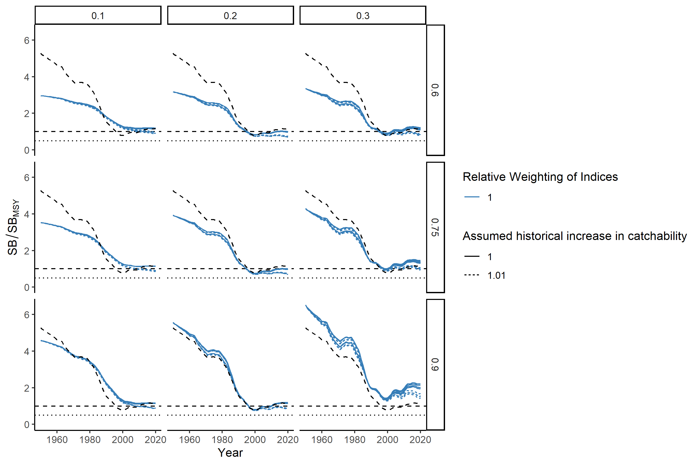
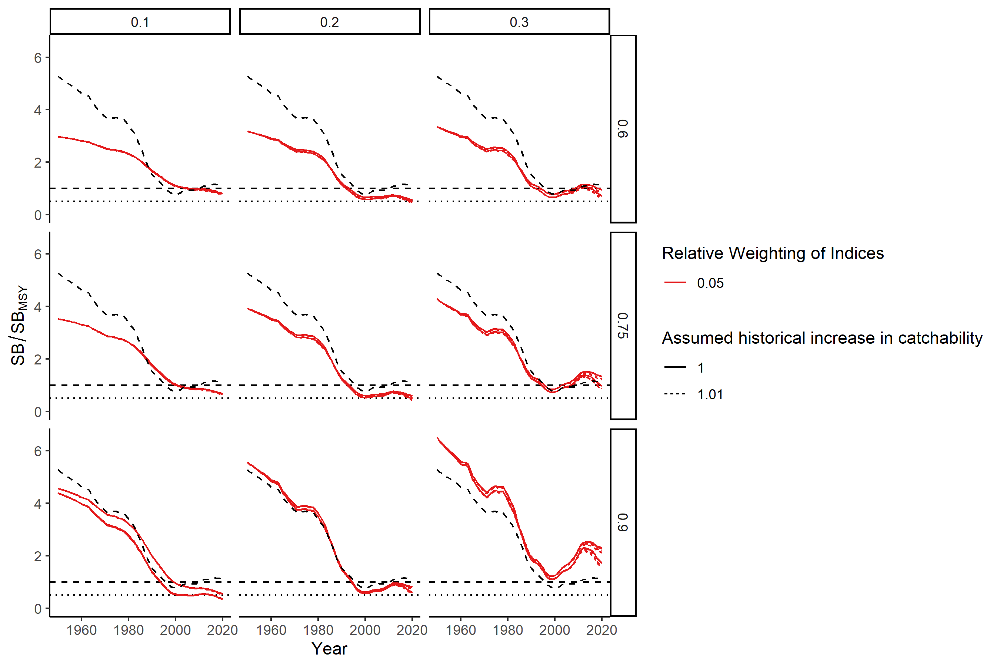
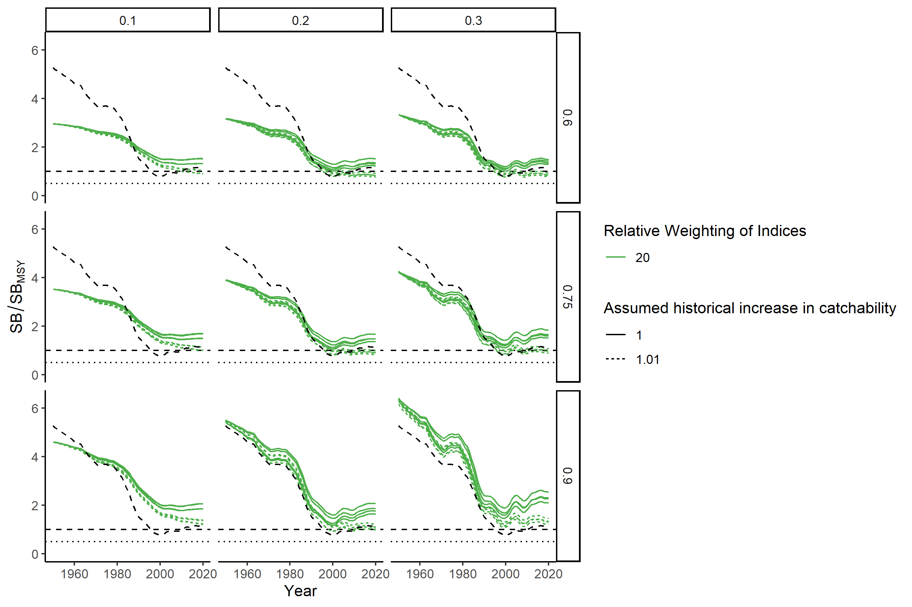
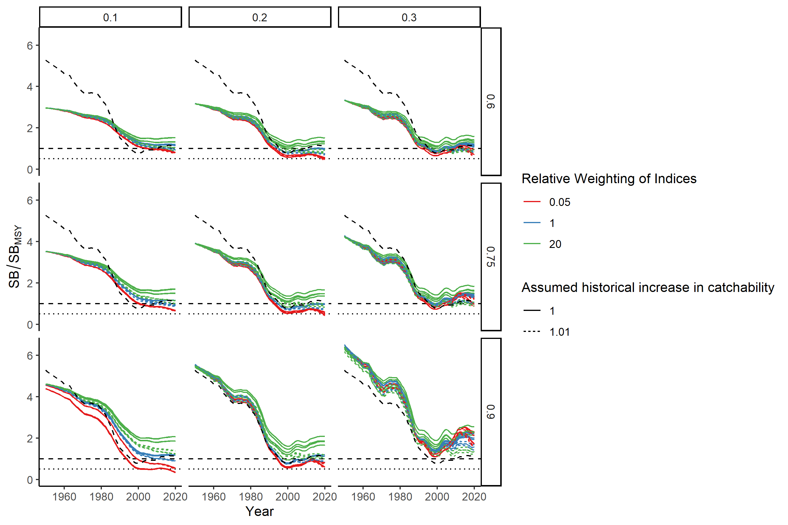

```{r setup, include=FALSE}
library(dplyr)
library(htmltools)
library(ggplot2)
library(SWOMSE)
knitr::opts_chunk$set(echo = FALSE)

fig.num <- tab.num <- 0
fig.cap <- function() {
  fig.num <<- fig.num +1
  paste0('Figure ',  fig.num, '.')

} 
tab.cap <- function() {
  tab.num <<- tab.num +1
  paste0('Table ',  tab.num, '.')
}

```

# Introduction

This report summarizes the diagnostic checks, the calculated biological reference points, and the estimated stock status relative to those reference points, across the 216 operating models included in the OM Uncertainty Grid.  

## Operating Models 

`r tab.cap()` Summary table of the operating model uncertainty grid. `OM.num` can be used to reference the operating models in the tables and figures below. 

```{r}
DF <- OM_DF
DF <- DF %>% select(OM.num, M, sigmaR, steepness, cpuelambda, llq, env)
DF <- DF %>% filter(OM.num!='000')
DF$env <- as.logical(DF$env)
DF <- DF %>% mutate(across(1:7, as.factor))

DT::datatable(DF, 
              colnames=c('OM Number',
                         'M',
                         'sigmaR',
                         'Steepness (h)',
                         'Relative CPUE Weighting',
                         'Assumed historical increase in catchability',
                         'Include AMO Covariate'),
              filter = 'top',
              options = list(
                pageLength = 10, 
                autoWidth = TRUE,
                sDom  = '<"top">lrt<"bottom">ip')
)


```
# Model Diagnostic Checks

## Report Estimated Parameters Near Bounds

`r tab.cap()` Table of estimated parameters within 1% of the bounds.

```{r}
Check_Bounds_DF <- readRDS('Check_Bounds_DF.rda')

Check_Bounds_DF <- Check_Bounds_DF %>% mutate(across(c(1:7, 12), as.factor))
Check_Bounds_DF <- Check_Bounds_DF %>% select(OM.num, Min, Max, SD, Parameter) %>%
  relocate(OM.num, Parameter)

DT::datatable(Check_Bounds_DF,
              filter = 'top',
              options = list(
                pageLength = 10, 
                autoWidth = TRUE,
               sDom  = '<"top">lrt<"bottom">ip')
)

```

## Check for Convergence: Invertible Hessian and Final Gradient

`r tab.cap()` Table of log determinant of the Hessian matrix, (finite values indicate invertible Hessian), the maximum final gradient, high_grad (true if the final gradient for one or more parameters are > 0.0001), and the final gradient values for the estimated parameter(s).

```{r}
Check_Convergence_DF <- readRDS('Check_Convergence_DF.rda')

Check_Convergence_DF <- Check_Convergence_DF %>% select(OM.num,  log_det_hessian, invertible,
                                              max_final_gradient, high_grad, 
                                              Gradient, Parameter) %>%
  relocate(OM.num, Parameter)

DT::datatable(Check_Convergence_DF,
              filter = 'top',
              options = list(
                pageLength = 10, 
                autoWidth = TRUE,
                sDom  = '<"top">lrt<"bottom">ip')
)


```

## Check for Highly Correlated Parameters

`r tab.cap()` Table of operating model parameters that have correlation factor > 0.95.

```{r}
Check_Correlation_DF <- readRDS('Check_Correlation_DF.rda')

DT::datatable(Check_Correlation_DF,
              filter = 'top',
              options = list(
                pageLength = 10, 
                autoWidth = TRUE,
                sDom  = '<"top">lrt<"bottom">ip')
)


```


# Biological Reference Points

## Summary Table

`r tab.cap()` Summary table of the calculated biological reference points for the OMs in the uncertainty grid. 

```{r}
ReferencePoint_DF <- readRDS('ReferencePoint_DF.rda')

RefPointDF <- ReferencePoint_DF %>% select(OM.num, SB0, SBMSY, FMSY, MSY_d, MSY_r)
RefPointDF$OM.num <- factor(RefPointDF$OM.num)

DT::datatable(RefPointDF,
              filter = 'top',
              options = list(
                pageLength = 10, 
                autoWidth = TRUE,
                sDom  = '<"top">lrt<"bottom">ip')
)
```


## Boxplots by Axes 

The following plots show boxplots of the biological reference points. The plots are faceted by natural mortality (M; columns) and steepness (h; rows), the two axes that had the largest impact on the reference points, and color-coded by the levels of the remaining axes.

```{r}
ReferencePoint_DF <- ReferencePoint_DF %>% mutate(across(1:6, as.factor))

fig_name_list <- readRDS('ref_plot_list.rda')
ref_points <- c('SB0', 'SBMSY', 'FMSY', 'MSY_r')
ref_labels <- c('SB~0~', 'SB~MSY~', 'F~MSY~', 'MSY (retained)')
factors <- colnames(ReferencePoint_DF)[c(2,4:6)]

heading_list <- plot_list <- fig_cap_list <- height_list <- width_list <- list()

for (i in seq_along(ref_points)) {
  ref <- ref_points[i] %>% as.character()
  heading_list[[i]] <- paste0('\n### ', ref_labels[i], '\n') 
  plot_list[[i]] <- list()
  fig_cap_list[[i]] <- list()
  height_list[[i]] <- list()
  width_list[[i]] <- list()
  
  for (j in seq_along(factors)) {
    var <- factors[j]  %>% as.character()
    n_levels <- ReferencePoint_DF[[var]] %>% levels() %>% length()
    this.fig.num <- fig.cap()
    caption<- paste('\n\n', this.fig.num, 'Boxplots of estimated', ref, 
                     'faceted by natural mortality (M; columns) and steepness (h; rows), and color coded by',
                     n_levels, 'levels of', var, '.\n\n\n')
  
    fig_cap_list[[i]][[j]] <- caption
  }
}


```

```{r, results='asis', width=6, height=6}
for (i in seq_along(ref_points)) {
  cat(heading_list[[i]])
  for (j in seq_along(factors)) {
    cat('\n, ')')
    cat(fig_cap_list[[i]][[j]])
  }
}


```


# Estimated Stock Status

## Summary Table

`r tab.cap()` Summary table of the estimated stock dynamics relative to the biological reference points for the OMs in the uncertainty grid. 

```{r}
RefPointDF <- ReferencePoint_DF %>% select(OM.num, SB_SB0, SB_SBMSY, F_FMSY)
RefPointDF$OM.num <- factor(RefPointDF$OM.num)
RefPointDF[,2:4] <- round(RefPointDF[,2:4], 2)
DT::datatable(RefPointDF,
              filter = 'top',
              options = list(
                pageLength = 10, 
                autoWidth = TRUE,
                sDom  = '<"top">lrt<"bottom">ip')
)
```


## Boxplots by Axes

The following plots show boxplots of the estimated stock status relative to the biological reference points. The plots are faceted by natural mortality (M; columns) and steepness (h; rows), the two axes that had the largest impact on the reference points, and color-coded by the levels of the remaining axes.

```{r}
ReferencePoint_DF <- ReferencePoint_DF %>% mutate(across(1:6, as.factor))

fig_name_list <- readRDS('status_ref_plot_list.rda')
ref_points <- c('SB_SB0', 'SB_SBMSY', 'F_FMSY')
ref_labels <- c('SB/SB~0~', 'SB/SB~MSY~', 'F/F~MSY~')
factors <- colnames(ReferencePoint_DF)[c(2,4:6)]

heading_list <- plot_list <- fig_cap_list <- height_list <- width_list <- list()

for (i in seq_along(ref_points)) {
  ref <- ref_points[i] %>% as.character()
  heading_list[[i]] <- paste0('\n### ', ref_labels[i], '\n') 
  plot_list[[i]] <- list()
  fig_cap_list[[i]] <- list()
  height_list[[i]] <- list()
  width_list[[i]] <- list()
  
  for (j in seq_along(factors)) {
    var <- factors[j]  %>% as.character()
    n_levels <- ReferencePoint_DF[[var]] %>% levels() %>% length()
    this.fig.num <- fig.cap()
    caption<- paste('\n\n', this.fig.num, 'Boxplots of estimated', ref, 
                     'faceted by natural mortality (M; columns) and steepness (h; rows), and color coded by',
                     n_levels, 'levels of', var, '.\n\n\n')
  
    fig_cap_list[[i]][[j]] <- caption
  }
}


```

```{r, results='asis', width=6, height=6}
for (i in seq_along(ref_points)) {
  cat(heading_list[[i]])
  for (j in seq_along(factors)) {
    cat('\n, ')')
    cat(fig_cap_list[[i]][[j]])
  }
}


```

## SB/SB~MSY~ Time-Series Plots 

Almost all variation in the predicted stock dynamics can be explained by four factors: 

1. Natural mortality (*M*)
2. Steepness (*h*)
3. Relative weighting of the CPUE to CAL data (cpuelambda)
4. The assumed 1% increase in catchability in historical CPUEs

The following plots show the estimated $SB/SB_{MSY}$ across these four axes.  

### Default Weighting of CPUE Indices




`r fig.cap()` The estimated SB/SB~MSY~ faceted by *M* (columns) and steepness (*h*; rows), with line type indicating the levels for the assumed increase in catchability, and color showing the weighting of the CPUE data relative to the CAL data.

### Down weighting of CAL Data



`r fig.cap()` The estimated SB/SB~MSY~ faceted by *M* (columns) and steepness (*h*; rows), with line type indicating the levels for the assumed increase in catchability, and color showing the weighting of the CPUE data relative to the CAL data.


### Down weighting of CPUE Indices



`r fig.cap()` The estimated SB/SB~MSY~ faceted by *M* (columns) and steepness (*h*; rows), with line type indicating the levels for the assumed increase in catchability, and color showing the weighting of the CPUE data relative to the CAL data.


### All



`r fig.cap()` The estimated SB/SB~MSY~ faceted by *M* (columns) and steepness (*h*; rows), with line type indicating the levels for the assumed increase in catchability, and color showing the weighting of the CPUE data relative to the CAL data.


