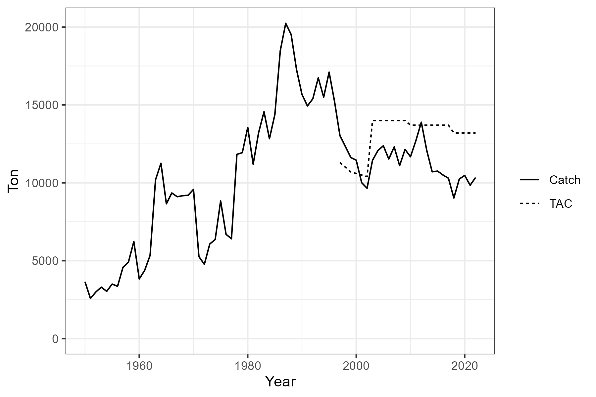
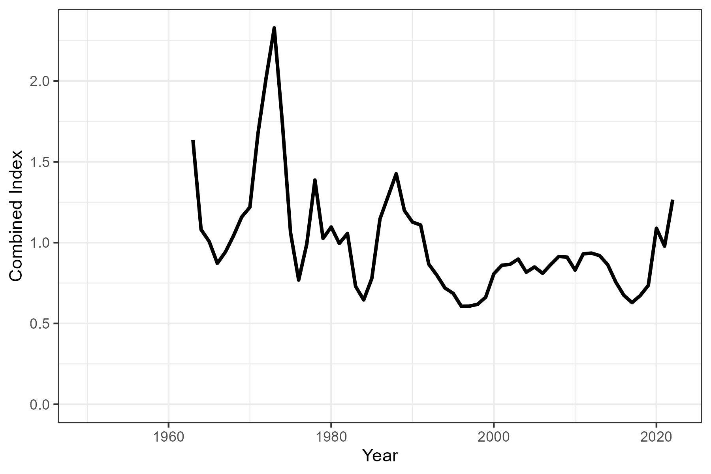
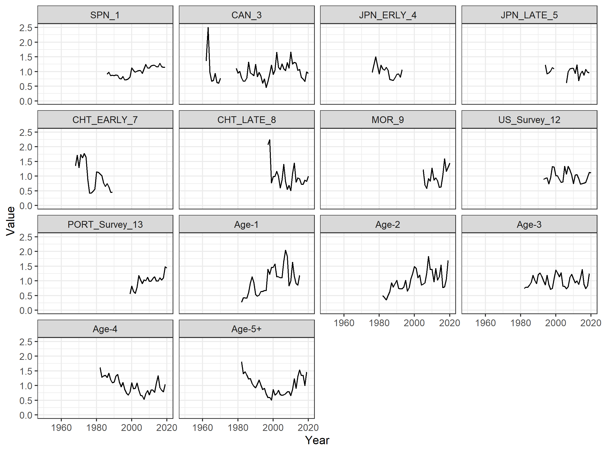

```{css, echo=FALSE}
.csl-entry {
    margin-bottom: 12px;
}
```

```{r, include=FALSE}
library(SWOMSE)
library(dplyr)
library(ggplot2)
knitr::opts_chunk$set(echo=FALSE)

MOM <- SWOMSE::MOM_000
```

# Introduction

The North Atlantic swordfish fishery, under the management of the [International Commission for the Conservation of Atlantic Tuna](https://www.iccat.int/en/index.asp) (ICCAT), is undergoing a management strategy evaluation (MSE) process.

ICCAT describes [MSE](https://www.iccat.int/mse/en/index.asp) as:

> a collaborative process between Scientists and decision-makers that involves using computer simulation to compare the relative ability to achieve a set of management objectives using alternative Management Strategies, defined as different combinations of data collection schemes, methods of analysis, harvest control rules and subsequent processes leading to management actions.

There are three main components in an MSE process:

1.  **Operating models (OMs)**: a collection of mathematical/statistical models that describe alternative hypotheses of the historical fishery dynamics and specifications for simulating the collection of data and implementation of management measures in the future;
2.  **Candidate management procedures (CMPs)**: a set of proposed algorithms that generate management recommendations from fishery data, and will be evaluated in the MSE;
3.  **Performance metrics (PMs)**: statistics use the quantitatively evaluate the CMPs against specified management objectives.

The operating models, candidate management procedures, and performance metrics are developed as a collaborative effort between scientists, decision-makers, and other stakeholders in the fishery.

## About this document

This document describes the specifications for the OMs, CMPs, and PMs that have been proposed and developed for the North Atlantic swordfish (hereafter swordfish) fishery.

It is a living document and will be continued to be updated so that it reflects the current state of the swordfish MSE process.

Members of the Swordfish Species Group (hereafter the Group) are encouraged to provide feedback, comments, or edits to any part of this document.

The document is written using the [Markdown](https://www.markdownguide.org/) format and can edited in any text editor. The source document is available on the [ICCAT/nswo-mse](https://github.com/ICCAT/nswo-mse/blob/master/docs/TS/Trial_Specs.Rmd) GitHub repository.

The [ICCAT/nswo-mse](https://github.com/ICCAT/nswo-mse) is currently private and only available to members of the Group. Please contact [Adrian Hordyk](mailto:adrian@bluematterscience.com) or [Ai Kimoto](mailto:ai.kimoto@iccat.int) if you do not have access.

Group members can make edits to the document either [directly in the online repository](https://github.com/ICCAT/nswo-mse/edit/master/docs/TS/Trial_Specs.Rmd) or by cloning the repository and submitting [pull requests](https://github.com/ICCAT/nswo-mse/pulls) with their edits. Alternatively, they can email questions or comments to [Adrian](mailto:adrian@bluematterscience.com). The former approach has the advantage that all comments, questions, and edits are immediately visible to all members of the Group.

Group members can also use the [Discussions](https://github.com/ICCAT/nswo-mse/discussions) feature on the Github repository to post questions, comments, or points for discussion related to any aspect of this document or the MSE process in general.

A HTML version of this document is available at the North Atlantic Swordfish MSE [homepage](https://iccat.github.io/nswo-mse/).

# Stock Assessment

Previously, the swordfish operating models were based on the 2017 stock assessment [@anon.Report2017ICCAT2017] using Stock Synthesis 3 [SS3, @methotStockSynthesisBiological2013].

A new stock assessment was conducted in 2022. The swordfish operating models have been updated based on this new assessment.

The report for this assessment is currently in preparation (see SCRS/2022/124). The data used in the 2022 assessment, and the structure and assumptions of the assessment model are summarized in the sub-sections below.

## Data {#data}

The assessment used landings data from 8 longline fleets (7 national fleets and 'Other' representing all catches not accounted for in the national fleets) (Table \@ref(tab:fleet-info) and Figure \@ref(fig:data-fig)).

There were 6 indices of abundance derived from catch-per-unit-effort (CPUE) data from the national fleets (Table \@ref(tab:fleet-info) and Figure \@ref(fig:data-fig)). Data from the Japan longline fleet was split into two phases: Early (1950 - 1993), and Late (1994 - 2020) due to changes in fishing practices in these periods. Similarly, the Chinese-Taipei longline fleet was split into two phases: Early (1950 - 1989) and Late (1990 - 2020). Five additional survey indices were developed from the age-specific (ages estimated from length data) CPUE from the Spain longline fleet (Table \@ref(tab:fleet-info) and Figure \@ref(fig:data-fig)).

Length composition data from 7 national fleets (Spain, U.S., Canada, Japan (Early, Late), Portugal, Chinese-Tapai, and Morocco) and mean weight data from two fleets (U.S. and Canada) was also used (Figure \@ref(fig:data-fig)).

The catchability coefficient (*q*) for the CPUE indices for Canada, Japan, Portugal, Morocco, and the Spain age-specific survey indices, was made a function of the Atlantic Multidecadal Oscillation (AMO) [See @anon.Report2017ICCAT2017 for details].

The effective sample size (ESS) for the length composition data was established by adjusting ESS until unity was reached between modeled ESS and the Francis suggested sample size [See @anon.Report2017ICCAT2017 for details].

```{r fleet-info}

DF <- Fleet_DF <- SWOMSE::Fleet_DF
DF$index <- NULL
DF <- DF[-19,]

col.names <- colnames(DF)
# col.names[4] <- 'CPUE Period'
caption <- 'Summary table of the fishing fleets and indices of abundances included the 2022 stock assessment of North Atlantic swordfish.'
DF %>% knitr::kable(escape = F,
                    caption=caption,
                    booktabs=TRUE,
                    col.names = col.names) %>%
  kableExtra::kable_styling("striped", full_width = T)

```


## Model Structure {#model-structure}

The SS3 model used one season, one area, and two sexes.

## Fixed Biological Parameters

Natural mortality for both male and female was fixed at 0.2 for all age classes. Maturity-at-age was knife-edge, with 50% at age-5 and 100% thereafter. Fecundity was proportional to body weight. The growth parameters for the 2022 assessment were fixed at same used in the 2017 assessment, which were developed during the 2017 ICCAT Swordfish Data Preparatory Meeting [See @anon.Report2017ICCAT2017 for details].

## Selectivity

Selectivity was modeled as a function of length. Dome-shaped selectivity was allowed for five fleets: EU-Spain, USA, Japan, EU-Portugal, and Morocco. Asymptotic selectivity was assumed for Canada, Chinese-Taipei and Other. The age-specific survey CPUEs were modeled with a fixed age-based selectivity.

## Retention and Discard Mortality

The 2022 assessment assumed a minimum legal length of 119 cm lower jaw fork length (LFFL) for all fleets from 1993 - 2020, and estimated the selectivity and retention curves from the available data. Discard mortality was either estimated from the observer data (USA and Canada) or fixed at values taken from the literature (see SCRS/2022/124).

## Stock-Recruitment

Expected recruitment to age-0 was calculated from the total spawning stock biomass using the Beverton-Holt stock-recruit function. The standard error for the log-normally distributed recruitment deviations (sigmaR) was fixed to 0.2. Steepness (*h*) was fixed at the value estimated in the 2017 assessment (0.88).

# OM Conditioning {#om-conditioning}

The 2022 stock assessment was used as a base case model for developing the operating models evaluated in the MSE.

## OM Uncertainty Grid

In 2019, the Swordfish Species Group developed an OM uncertainty grid using a full factorial design with 6 axes of uncertainty:

1.  Natural mortality (*M*) - three levels: 0.1, 0.2, 0.3

2.  Recruitment variability (sigmaR; $\sigma_R$) - two levels: 0.2, 0.6

3.  Steepness (*h*) - three levels: 0.6, 0.75, 0.90

4.  CPUE Lambda - three levels: 0.05, 1, 20

5.  Directional trend in catchability (llq) - two levels: TRUE, FALSE

6.  Environmental covariate (env) - two levels: TRUE, FALSE

The directional increase in catchability was modeled by assuming a 1% average annual increase in catchability throughout the history of the fishery, and adjusting the CPUE indices accordingly.

The environmental covariate was included by modeling catchability as a function of the AMO, as was done in the 2017 and 2022 stock assessments.

This factorial design of the 6 axes of uncertainty, each with 2 or 3 levels, resulted in an uncertainty grid of 216 OMs.

## Evaluation of the OM Grid

Previous analyses of the OM uncertainty grid based on the 2017 assessment revealed that the three levels of natural mortality and steepness had the largest impact on the predicted stock dynamics [Hordyk et al., 2021](https://iccat.github.io/nswo-mse/SCRS_Papers//Hordyk_et_al_SCRS_2021_099.pdf) and are therefore the most important axes of uncertainty in the OM grid. 

The second level of recruitment variability ($\sigma_R = 0.6$) had a minor impact on the predicted stock dynamics [Hordyk et al., 2021](https://iccat.github.io/nswo-mse/SCRS_Papers//Hordyk_et_al_SCRS_2021_099.pdf), but did influence the relative performance of candidate management procedures [Hordyk, 2021](https://iccat.github.io/nswo-mse/SCRS_Papers//Hordyk_SCRS_2021_161.pdf). This second level is now treated as a robustness test (see below for more details).

The fourth axis of uncertainty was intended to evaluate the effect of alternative relative weightings of the length composition data and the indices of abundance. The three levels reflect a complete down-weighting of the indices of abundance (0.05; effectively only fitting the model to the length composition data), leaving the relative weighting of the two data sources unchanged from that used in the assessment (1), and up-weighting the indices of abundance so the model ignores the length composition data (20). This was done because of apparent conflicting signals between the length composition data and some of the indices of abundance, and the high computation demand of conducting the recommended iterative re-weighting procedure across all OMs in the grid [@francisDataWeightingStatistical2011]. However, this iterative re-weighting procedure has now been conducted for the new operating models based on the 2022 assessment, and therefore this axis of uncertainty has been modified to two levels: 1) fit the assessment to both length and CPUE data and conduct the iterative re-weighting procedure, and 2) only fit the model to the CPUE data. This second level is now treated as a robustness test (see below for more details).

The fifth axis of uncertainty with the assumed 1% increase in catchability for the indices of abundance had a relatively minor influence on both the predicted stock dynamics [Hordyk et al., 2021](https://iccat.github.io/nswo-mse/SCRS_Papers//Hordyk_et_al_SCRS_2021_099.pdf) and the performance of candidate management procedures [Hordyk, 2021](https://iccat.github.io/nswo-mse/SCRS_Papers//Hordyk_SCRS_2021_161.pdf). The second level of this axis is now treated as a robustness test (see below for more details).

In both the 2017 and 2022 stock assessments, the catchability coefficient (*q*) for the CPUE indices for Canada, Japan, Portugal, Morocco, and the Spain age-specific survey indices, was made a function of the Atlantic Multidecadal Oscillation (AMO). Including this environmental covariate resulted in a better statistical fit to the data for these indices. The sixth axis of uncertainty examined the impact of not including this environmental covariate in the stock assessment. The analyses revealed that removing the environmental covariate from the assessment model had no detectable influence on either the predicted stock dynamics [Hordyk et al., 2021](https://iccat.github.io/nswo-mse/SCRS_Papers//Hordyk_et_al_SCRS_2021_099.pdf) or the performance of candidate management procedures [Hordyk, 2021](https://iccat.github.io/nswo-mse/SCRS_Papers//Hordyk_SCRS_2021_161.pdf). Therefore, the environmental covariate was included in all models in the OM grid. Further examination of the impact of changing environmental conditions on the performance of the candidate management procedures may be examined in additional robustness tests (see below for more details).

This same pattern in results was found when the analyses were re-conducted with the new OM grid based on the 2022 assessment. 

## Reference Operating Models

Based on these analysis, a set of 9 operating models were identified as the main reference set. These operating models spanned the three levels of *M* and *h* and had the following assumptions:

1. Following the assessment, $\sigma_R = 0.2$
2. The Francis iterative re-weighting procedure was conducted on each operating model to find the appropriate weighting between the length compostion data and the indices of abundance
3. The standardized indices of abundance were used (i.e., no assumed 1% increase in catchability)

These 9 OMs are referred to as the Reference OMs. 

## Robustness Operating Models 

The remaining operating models were considered as Robustness Test OMs. 

### Higher Recruitment Variability

This set of 9 operating models had the same structure and assumptions as the Reference Set, with the exception that the recruitment variability was assumed to higher $(\sigma_R = 0.6)$

### Removing Length Data 

This set of 9 operating models had the same structure and assumptions as the Reference Set, with the exception that the model was only fit to the indices of abundance (i.e., fits to the length composition data were not included in the total likelihood).

### Assumed Increase in Catchability

This set of 9 operating models had the same structure and assumptions as the Reference Set, with the exception that the indices of abundance were modified to assume an average 1% increase in catchability over the historical period. The Francis iterative re-weighting procedure has not yet been conducted for this operating models, and therefore these OMs have not yet been included in the MSE framework. 

### Other Robustness Tests

Other robustness test, for example examining the impact of changing environmental conditions in the future projection period may be developed by the Group and will be described here. 

## OM Validation

### OM Summary Report

A [Summary Report](../Reports/OM_Summary/2022/OM_Summary_Report.html) summarizes the diagnostic checks, the calculated biological reference points, and the estimated stock status relative to those reference points, across the 216 operating models included in the OM Uncertainty Grid.

A SCRS document is currently being prepared summarizing this information, and will be presented at the 2022 Species Group Meeting of the Swordfish Working Group. 

### OM Diagnostic Reports

Individual diagnostic reports with objective function values and plots of model fits and patterns in residuals are available for each of the 216 OMs (and the 2022 assessment) on the North Atlantic Swordfish MSE [homepage](https://iccat.github.io/nswo-mse/).

# MSE Framework

The `SWOMSE` R package has been developed to conduct the MSE for the Atlantic swordfish fishery. All code used for the MSE is open-source and reproducible. Group members can install the package and reproduce the analysis on their own machines.

## Installing the package

The `SWOMSE` package can be installed directly from the [GitHub repository](https://github.com/ICCAT/nswo-mse) using the `devtool` package:

```{r, eval=FALSE, echo=TRUE}
# install.packages("devtools")
devtools::install_github("ICCAT/nswo-mse", auth_token='your_personal_access_token')
```

Note that as this repository is private, you will need to provide a personal access token to download and install from GitHub. See [here](https://docs.github.com/en/github/authenticating-to-github/creating-a-personal-access-token) for information on creating a personal access token.

## openMSE

The `SWOMSE` package used for the swordfish MSE uses the `openMSE` framework. The `openMSE` package is automatically installed when `SWOMSE` is installed, and all `openMSE` functions are available to the user when the `SWOMSE` package is loaded.

`openMSE` is an R package that has been developed for conducting fast, flexible, and transparent, MSE for a wide range of fisheries. `openMSE` is an umbrella package that includes the `MSEtool`, `SAMtool` and `DLMtool` packages. A non-technical description of `openMSE` and its key features is available on the [`openMSE` website](https://openmse.com/).

The operating model in `openMSE`, including assumptions and equations, is described in detail in @carruthersDataLimitedMethodsToolkit2018.

## Importing OMs into the MSE Framework {#importing-oms-into-mse-framework}

The 216 OMs in the uncertainty grid, conditioned using SS3, were imported into MSE framework using the `SS2MOM` function in `MSEtool` (see [here](https://msetool.openmse.com/reference/SS2MOM.html) for details on the function).

Previously, the 2-sex SS3 models were imported into a combined single-sex operating model in the MSE framework. The MSE framework was updated in 2022, and the imported operating models now maintain the separate sexes in the same manner as the SS3 assessment. Since the fishery is managed with a single overall total allowable catch (TAC), the individual fishing fleets were aggregated together in the operating models.

The 2-sex operating model are available in the `SWOMSE` package as objects of class `MOM` (multi-stock operating model). For example, the 2022 stock assessment is available as the base case operating model named `MOM_000`:

```{r, echo=TRUE}
library(SWOMSE)
MOM_000@Name
```


# Historical Spool-Up Period

The historical spool-up period was generated by importing the output from the SS3 assessment models and running the MSE simulation framework to recreate the historical fishery dynamics. No additional uncertainty was added to the historical simulations; that is, all `r MOM@nsim` simulations were identical (e.g., same recruitment deviations) for the historical spool-up period.

The operating models have been conditioned on data up to and including 2020 (see the [Data section](#data)), and therefore the projection period for the MSE framework starts in the following year, i.e., 2021. Currently, model uses assumed catches for the first two years (2021 and 2022) and then implements the management procedures in the following year (i.e., 2023). See the [Future Catches](#future-catches) section for more information.  

## Historical Data
The observed fishery data was imported into the MSE framework and made available to the CMPs. Three sources of data available to the CMPs: 1) catch data, 2) a primary index of abundance, and 3) additional individual indices.

### Catch Data

The catch data used in the OM conditioning are made available in the simulated data that is provided to the CMPs (Figure \@ref(fig:catch-plot)).



### Indices of Abundance

#### Primary Index

At the [2020 Swordfish MSE technical meeting (4 -- 5 June 2020)](./Meeting_Reports/2020_SWO_MSE_1_ENG.pdf), the Group chose to use the Combined Index [@ortizUpdatedCombinedBiomass2017] as the primary index for the development of CMPs. This index was updated for the 2022 assessment. The Combined Index was imported into the `SWOMSE` framework and made available to the CMPs (Figure \@ref(fig:index-plot)).




#### Other Indices
The additional individual fishery-dependent and survey indices are also imported into the MSE framework and made available to the CMPs (Figure \@ref(fig:addindex-plot)). 




# Closed-Loop Simulation Testing

## Simulation Specifications


The current simulation specifications for the MSE are:

1.  Management interval: 3 (i.e., TAC updated every 3rd year)
2.  Number of projection years: 30
3.  Number of simulations per OM: `r MOM@nsim`


## Assumptions

### Recruitment

The stock-recruitment relationship in the projection years was modeled using the Beverton-Holt function, with steepness fixed at the value assumed in the OM conditioning.

Recruitment deviations for the projection period were generated assuming a log-normal distribution with mean $\mu_R$ and variance $\sigma_R^2$, calculated as:

$$\mu_R = -0.5\sigma_R^2\left(1-\frac{\text{AC}}{\sqrt{(1-\text{AC}^2)}}\right)$$

where AC is the lag-1 autocorrelation factor calculated from the historical recruitment deviations and $\sigma_R^2$ is the variance of the recruitment deviations specified in the OM (i.e., sigmaR\^2 defined [above](#om-conditioning)).

The recruitment deviations for the projection period were generated independently for each simulation.

### Life-History

Biological parameters such as mean weight-at-age and maturity-at-age were constant for all years (historical and projection).

### Selectivity

Currently, the selectivity-at-length for the projection years is fixed to the estimated selectivity pattern from the last historical year for each OM. The reviewer of the `SWOMSE` R code highlighted this as a possible uncertainty and recommended that the Group consider testing alternative assumptions for the selectivity pattern in the projection years [@anon.PeerReviewNorth2021].

> The Working Group will discuss this assumption in more detail and decide if it wishes to run scenarios with alternative assumptions for the selectivity pattern in the projection years.

### Catchability

No time-varying catchability is assumed for the projection years.

### Future Catches

The total allowable catch (TAC) recommended by the CMPs is assumed to be implemented without error. That is, annual catches are equal to the TAC recommendations (provided sufficient vulnerable biomass was available). The Group determined that this assumption was appropriate based on the fact that historically the total landed catch has been below the total allowable catch (TAC) (see Figure \@ref(fig:catch-plot)). 

The operating models also assume that the TACs recommended by the CMPs apply to the landed catch and do not include discards; that is, the actual removals will be higher than the TACs if there is discard mortality on the sub-legal fish.

Since the MSE projection period begins in 2021 (the year after the conditioning), and the landed catches are typically below the TAC (Figure \@ref(fig:catch-plot)), the MSE framework assumes that the catch in the first two projection years (2021 and 2022) is equal to specified TAC for those years (13,200 ton). 

The CMPs are then first implemented in 2023, and every 3rd year after that, with the TAC held constant in the interim years.


## Generation of Future Data

### Indices

The primary index of abundance (Combined Index) was generated in the projection years by adding observation error to the projected stock biomass, and standardizing to be on the same scale as the historical observed Combined Index.

The additional individual indices were generated in the projection years in the same manner, using the simulated stock biomass (or abundance in some cases).

The observation error was generated by calculating the statistical properties of the residuals from the fit of each respective index to the simulated stock (biomass or abundance) during the historical period. The procedure for calculating the residuals for the projection years is described in detail in the [openMSE documentation](https://openmse.com/features-conditioning-oms/indices/).

Following the assumptions of the stock assessment, it is assumed that all indices are proportional to the respective stock biomass or abundance (i.e., it is assumed that the indices are not hyper-stable or hyper-deplete). 

### Catches

Following the assumption of the stock assessment, the observed catches in the projection years were generated with no observation error. That is, the observed catches in the MSE framework are equal to the actual simulated landed catches (provided there is sufficient biomass in the simulated population to support the prescribed TAC). The model does not include a bio-economic component and inter-annual change in fishing effort is unconstrained. 

### Data Lags
Data lags of several years are common for many fisheries. For example, the 2022 assessment used data up to and including 2020. Assuming a CMP will be used to generate a TAC recommendation for 2023 based on this data, this is a data lag of 3 years. 

In the MSE framework, the CMPs are always provided with the simulated fishery data up to the previous year. That is, if a CMP is implemented in year $t$, the catch and indices of abundance data provided to the CMP are up to and including year $t-1$. 

Data lags are then handled in the CMP code, where the default assumption is that the catch and index data are lagged by 3 years. See the CMP (see the [CMP Development Guide](../cMPdevelopment/CMP-Development-Guide.html) for more details).

## Management Interval

At the 2021 [Intersessional meeting](/Meeting_Reports/2021_SWO_ENG.pdf), the Group proposed a 3-year MP advice interval (see Table 5 in the [Report of the 2021 ICCAT Intersessional Meeting of the Swordfish Species Group](../Meeting_Reports//2021_SWO_ENG.pdf)).

The operating models have been conditioned on data up to 2020. As described [above](#future-catches), the model assumes that the catch is 2021 and 2022 is equal to the current TAC (13,200 ton), and then begins applying the CMPs in 2023.  

The 3-yr management interval is applied within the CMP code (see the [CMP Development Guide](../cMPdevelopment/CMP-Development-Guide.html) for more details).

# Candidate Management Procedures

At this point, the candidate management procedures have not yet been developed.

The Group decided that CMP development work should involve the national scientists. A small group was formed at the November 2020 MSE technical meeting, lead by Dr K. Gillespie, with the aim of continuing the CMP development work in 2021.

A [CMP Development Guide](../cMPdevelopment/CMP-Development-Guide.html) is available on the swordfish [MSE homepage](https://iccat.github.io/).

# Performance Metrics

Based on feedback from the Commission's Panel 4, the following preliminary performance metrics have been proposed for swordfish:

| Name             | Description                                                           | Statistic                                  | Time Period (Years) | Minimum Acceptable Probability | Notes                          |
|------------|----------------|------------|------------|------------|------------|
| Safety - Short   | Maintain low probability of stock declining to unacceptably low level | Prob. SB \< SB~lim~                        | 1 - 10              | 5 - 10%                        | SB~lim~ defined as 0.4 SB~MSY~ |
| Safety - Medium  | As above                                                              | As above                                   | 11 - 30             | 5 - 10%                        |                                |
| Status - Short   | Maintain stock in green quadrant of the Kobe matrix                   | Prob SB \> SB~MSY~ & F \< F~MSY~           | 1 - 10              | 50 - 60%                       |                                |
| Status - Medium  | As above                                                              | As above                                   | 11 - 30             | 50 - 60%                       |                                |
| Stability        | Minimize large inter-annual changes in yield                          | Average annual variability in yield (AAVY) | 1 - 30              | Maximum AAVY of 15 - 25%       |                                |
| Short-term Yield | Maximize yield while meeting other objectives                         | Average catch                              | 1 - 10              | \-                             |                                |
| Long-term Yield  | As above                                                              | As above                                   | 11 - 30             | \-                             |                                |

A Google sheet has also been created for the Group to add comments or additional [Performance Metrics](https://docs.google.com/spreadsheets/d/1NytREnFCZ6OPrhXT5E5Wi8Y22w-ZmENY8kEZqDH_FQE/edit?usp=sharing).

#TODO 
biomass performance metrics and Kobe space calculated for females 

# References
