```{css, echo=FALSE}
.csl-entry {
    margin-bottom: 12px;
}

.book .book-body .page-inner {
    max-width: 1200px;
}

```

```{r, include=FALSE}
library(SWOMSE)
library(dplyr)
library(ggplot2)
knitr::opts_chunk$set(echo=FALSE, warning=FALSE)
options(scipen=999)
MOM <- SWOMSE::MOM_001
```

# Introduction

The North Atlantic swordfish fishery, under the management of the [International Commission for the Conservation of Atlantic Tuna](https://www.iccat.int/en/index.asp) (ICCAT), is undergoing a management strategy evaluation (MSE) process.

ICCAT describes [MSE](https://www.iccat.int/mse/en/index.asp) as:

> a collaborative process between Scientists and decision-makers that involves using computer simulation to compare the relative ability to achieve a set of management objectives using alternative Management Strategies, defined as different combinations of data collection schemes, methods of analysis, harvest control rules and subsequent processes leading to management actions.

There are three main components in an MSE process:

1.  **Operating models (OMs)**: a collection of mathematical/statistical models that describe alternative hypotheses of the historical fishery dynamics and specifications for simulating the collection of data and implementation of management measures in the future;
2.  **Candidate management procedures (CMPs)**: a set of proposed algorithms that generate management recommendations from fishery data, and will be evaluated in the MSE;
3.  **Performance metrics (PMs)**: statistics use the quantitatively evaluate the CMPs against specified management objectives.

The operating models, candidate management procedures, and performance metrics are developed as a collaborative effort between scientists, decision-makers, and other stakeholders in the fishery.

## About this document

This document describes the specifications for the OMs, CMPs, and PMs that have been proposed and developed for the North Atlantic swordfish (hereafter swordfish) fishery.

It is a living document and will be continued to be updated so that it reflects the current state of the swordfish MSE process.

Members of the Swordfish Species Group (hereafter the Group) are encouraged to provide feedback, comments, or edits to any part of this document.

The document is written using the [Markdown](https://www.markdownguide.org/) format and can edited in any text editor. The source document is available on the [ICCAT/nswo-mse](https://github.com/ICCAT/nswo-mse/blob/master/docs/TS/Trial_Specs.Rmd) GitHub repository.

Group members can make edits to the document either [directly in the online repository](https://github.com/ICCAT/nswo-mse/edit/master/docs/TS/Trial_Specs.Rmd) or by cloning the repository and submitting [pull requests](https://github.com/ICCAT/nswo-mse/pulls) with their edits. Alternatively, they can email questions or comments to [Adrian](mailto:adrian@bluematterscience.com). The former approach has the advantage that all comments, questions, and edits are immediately visible to all members of the Group.

Group members can also use the [Discussions](https://github.com/ICCAT/nswo-mse/discussions) feature on the Github repository to post questions, comments, or points for discussion related to any aspect of this document or the MSE process in general.

This document is available at the North Atlantic Swordfish MSE [homepage](https://iccat.github.io/nswo-mse/).

# MSE Framework

The `SWOMSE` R package has been developed to conduct the MSE for the Atlantic swordfish fishery. All code used for the MSE is open-source and reproducible. Group members can install the package and reproduce the analysis on their own machines.

The `SWOMSE` package used for the swordfish MSE uses the `openMSE` framework. The `openMSE` package is automatically installed when `SWOMSE` is installed, and all `openMSE` functions are available to the user when the `SWOMSE` package is loaded.

`openMSE` is an R package that has been developed for conducting fast, flexible, and transparent, MSE for a wide range of fisheries. `openMSE` is an umbrella package that includes the `MSEtool`, `SAMtool` and `DLMtool` packages. A non-technical description of `openMSE` and its key features is available on the [`openMSE` website](https://openmse.com/).

The operating model in `openMSE`, including assumptions and equations, is described in detail in @carruthers2018b

The [`SWOMSE` User Manual](../UserManual/User_Manual.html) includes instructions for installing the `SWOMSE` package and running the MSE analyses. 


# Stock Assessment {#stock-assessment}

Previously, the swordfish operating models were based on the 2017 stock assessment [@anon.2017] using Stock Synthesis 3 [SS3, @methot2013].

A new stock assessment was conducted in 2022. The swordfish operating models have been updated based on this new assessment.

The report for the 2022 stock assessment is published in [SCRS/2022/012](https://www.iccat.int/Documents/CVSP/CV079_2022/n_2/CV079020392.pdf). Details of the 2022 assessment are published in [SCRS/2022/124](../SCRS_Papers/Schirripa_SCRS_2022_124.pdf). The data used in the 2022 assessment, and the structure and assumptions of the assessment model are summarized in the sub-sections below.

## Data {#data}

The assessment used landings data from 8 longline fleets (7 national fleets and 'Other' representing all catches not accounted for in the national fleets) (Table \@ref(tab:fleet-info) and Figure \@ref(fig:data-fig)).

There were 6 indices of abundance derived from catch-per-unit-effort (CPUE) data from the national fleets (Table \@ref(tab:fleet-info) and Figure \@ref(fig:data-fig)). Data from the Japan longline fleet was split into two phases: Early (1950 - 1993), and Late (1994 - 2020) due to changes in fishing practices in these periods. Similarly, the Chinese-Taipei longline fleet was split into two phases: Early (1968 - 1989) and Late (1997 - 2020). Five additional survey indices were developed from the age-specific (ages estimated from length data) CPUE from the Spain longline fleet (Table \@ref(tab:fleet-info) and Figure \@ref(fig:data-fig)).

Length composition data from 7 national longline fleets (Spain, U.S., Canada, Japan (Early, Late), Portugal, Chinese-Tapai (Early, Late), and Morocco) and the Canada/USA harpoon fleet (Figure \@ref(fig:data-fig)). Mean weight data from two fleets (U.S. and Canada) were also used (Figure \@ref(fig:data-fig)).

The catchability coefficient (*q*) for the CPUE indices for Canada, Morocco, and the Age-1, Age-2, and Age-4 Spain age-specific survey indices, was made a function of the Atlantic Multidecadal Oscillation (AMO) (see [SCRS/2022/124](../SCRS_Papers/Schirripa_SCRS_2022_124.pdf) for details).

The effective sample size (ESS) for the length composition data was established by adjusting ESS until unity was reached between modeled ESS and the Francis suggested sample size [See @anon.2017 for details].

```{r fleet-info}

DF <- Fleet_DF <- SWOMSE::Fleet_DF
DF$index <- NULL
DF <- DF[-19,]

col.names <- colnames(DF)
# col.names[4] <- 'CPUE Period'
caption <- 'Summary table of the fishing fleets and indices of abundances included the 2022 stock assessment of North Atlantic swordfish.'
DF$Name <- as.character(DF$Name)
DF$Name <- gsub("-", ' ', DF$Name)
DF$Name <- gsub("/", ' ', DF$Name)
DF$Code <- gsub("-", ' ', DF$Code)
DF$Name <- gsub("\\+", ' plus', DF$Name)
DF$Code <- gsub("\\+", ' plus', DF$Code)
DF$Code <- gsub("_", ' ', DF$Code)
DF %>% knitr::kable(escape = F,
                    caption=caption,
                    booktabs=TRUE,
                    col.names = col.names) %>%
  kableExtra::kable_styling("striped", full_width = T)

```

```{r data-fig, fig.cap='Summary of the data used in the 2022 stock assessment.', out.width = "800px"}
knitr::include_graphics('../../img/Data_overview.png')
```


## Model Structure {#model-structure}

The SS3 model used one season, one area, and two sexes.

## Fixed Biological Parameters

Natural mortality for both male and female was fixed at 0.2 for all age classes. Maturity-at-age was knife-edge, with 50% at age-5 and 100% thereafter. Fecundity was proportional to body weight. The growth parameters for the 2022 assessment were fixed at same used in the 2017 assessment, which were developed during the 2017 ICCAT Swordfish Data Preparatory Meeting [See @anon.2017 for details].

## Selectivity

Selectivity was modeled as a function of length. Dome-shaped selectivity was allowed for five fleets: EU-Spain, USA, Japan, EU-Portugal, and Morocco. Asymptotic selectivity was assumed for Canada, Chinese-Taipei and Other. The age-specific survey CPUEs were modeled with a fixed age-based selectivity.

## Retention and Discard Mortality {#retention}

The 2022 assessment assumed a minimum legal length of 119 cm lower jaw fork length (LFFL) for all fleets from 1993 - 2020, and estimated the selectivity and retention curves from the available data. Discard mortality was either estimated from the observer data (USA and Canada) or fixed at values taken from the literature (see SCRS/2022/124).

## Stock-Recruitment

Expected recruitment to age-0 was calculated from the total spawning stock biomass using the Beverton-Holt stock-recruit function. The standard error for the log-normally distributed recruitment deviations (sigmaR) was fixed to 0.2. Steepness (*h*) was fixed at the value estimated in the 2017 assessment (0.88).

# Overview of Operating Model Conditioning {#om-conditioning}

In 2024, the indices and catches used in the 2022 assessment were updated to include the years 2021 and 2022. This updated model was used to develop the operating models (OMs) used in the MSE.

## OM Uncertainty Grid

In 2019, the Swordfish Species Group developed an OM uncertainty grid using a full factorial design with 6 axes of uncertainty:

1.  Natural mortality (*M*) - three levels: 0.1, 0.2, 0.3

2.  Recruitment variability (sigmaR; $\sigma_R$) - two levels: 0.2, 0.6

3.  Steepness (*h*) - three levels: 0.6, 0.75, 0.90

4.  CPUE Lambda - three levels: 0.05, 1, 20

5.  Directional trend in catchability (llq) - two levels: TRUE, FALSE

6.  Environmental covariate (env) - two levels: TRUE, FALSE

The directional increase in catchability was modeled by assuming a 1% average annual increase in catchability throughout the history of the fishery, and adjusting the CPUE indices accordingly.

The environmental covariate was included by modeling catchability as a function of the AMO, as was done in the 2017 and 2022 stock assessments.

This factorial design of the 6 axes of uncertainty, each with 2 or 3 levels, resulted in an uncertainty grid of 216 OMs.

## Evaluation of the OM Grid

Previous analyses of the OM uncertainty grid based on the 2017 assessment revealed that the three levels of natural mortality and steepness had the largest impact on the predicted stock dynamics [Hordyk et al., 2021](https://iccat.github.io/nswo-mse/SCRS_Papers//Hordyk_et_al_SCRS_2021_099.pdf) and are therefore the most important axes of uncertainty in the OM grid.

The second level of recruitment variability ($\sigma_R = 0.6$) had a minor impact on the predicted stock dynamics [Hordyk et al., 2021](https://iccat.github.io/nswo-mse/SCRS_Papers//Hordyk_et_al_SCRS_2021_099.pdf), but did influence the relative performance of candidate management procedures [Hordyk, 2021](https://iccat.github.io/nswo-mse/SCRS_Papers//Hordyk_SCRS_2021_161.pdf). This second level is now treated as a robustness test (see below for more details).

The fourth axis of uncertainty was intended to evaluate the effect of alternative relative weightings of the length composition data and the indices of abundance. The three levels reflect a complete down-weighting of the indices of abundance (0.05; effectively only fitting the model to the length composition data), leaving the relative weighting of the two data sources unchanged from that used in the assessment (1), and up-weighting the indices of abundance so the model ignores the length composition data (20). This was done because of apparent conflicting signals between the length composition data and some of the indices of abundance, and the high computation demand of conducting the recommended iterative re-weighting procedure across all OMs in the grid [@francis2011]. However, this iterative re-weighting procedure has now been conducted for the new operating models based on the 2022 assessment, and therefore this axis of uncertainty has been modified to two levels: 1) fit the assessment to both length and CPUE data and conduct the iterative re-weighting procedure, and 2) only fit the model to the CPUE data. This second level is now treated as a robustness test (see below for more details).

The fifth axis of uncertainty with the assumed 1% increase in catchability for the indices of abundance had a relatively minor influence on both the predicted stock dynamics [Hordyk et al., 2021](https://iccat.github.io/nswo-mse/SCRS_Papers//Hordyk_et_al_SCRS_2021_099.pdf) and the performance of candidate management procedures [Hordyk, 2021](https://iccat.github.io/nswo-mse/SCRS_Papers//Hordyk_SCRS_2021_161.pdf). Therefore it was decided that the default assumption for the operating models was to use the same indices as were used in the 2022 stock assessment; .e., the indices were not adjusted for an assumed 1% annual increase in changeability. The second level of this axis, where the indices are adjusted for an assumed increase in catchability, is now treated as a robustness test (see below for more details).

In both the 2017 and 2022 stock assessments, the catchability coefficient (*q*) for the CPUE indices for Canada, Japan, Portugal, Morocco, and the Spain age-specific survey indices, was made a function of the Atlantic Multidecadal Oscillation (AMO). Including this environmental covariate resulted in a better statistical fit to the data for these indices. The sixth axis of uncertainty examined the impact of not including this environmental covariate in the stock assessment. The analyses revealed that removing the environmental covariate from the assessment model had no detectable influence on either the predicted stock dynamics [Hordyk et al., 2021](https://iccat.github.io/nswo-mse/SCRS_Papers//Hordyk_et_al_SCRS_2021_099.pdf) or the performance of candidate management procedures [Hordyk, 2021](https://iccat.github.io/nswo-mse/SCRS_Papers//Hordyk_SCRS_2021_161.pdf). Therefore, the environmental covariate was included in all models in the OM grid. Further examination of the impact of changing environmental conditions on the performance of the candidate management procedures may be examined in additional robustness tests (see below for more details).

This same pattern in results was found when the analyses were re-conducted with the new OM grid based on the 2022 assessment.

# Operating Models 

The OMs, conditioned using SS3, were imported into MSE framework using the `SS2MOM` function in `MSEtool` (see [here](https://msetool.openmse.com/reference/SS2MOM.html) for details on the function).

Previously, the 2-sex SS3 models were imported into a combined single-sex operating model in the MSE framework. The MSE framework was updated in 2022, and the imported operating models now maintain the separate sexes in the same manner as the SS3 assessment. Since the fishery is managed with a single overall total allowable catch (TAC), the individual fishing fleets were aggregated together in the operating models.

The 2-sex operating model are available in the `SWOMSE` package as objects of class `MOM` (multi-stock operating model). 

The operating models have been classified into two categories: Reference OMs and Robustness OMs. Table \@ref(tab:OM-Description) provides a general overview of the operating models includes in the MSE analysis. The following sub-sections describe the Reference and Robustness OMs in more detail.

```{r OM-Description}
OM_desc <- read.csv(file.path('../../inst/OM_Description.csv'))
# OM_desc$OM.objects <- NA

# add MOM objects
for (i in 1:nrow(OM_desc)) {
  cl <- OM_desc$Class[i]
  df <- OM_DF %>% dplyr::filter(Class==cl)
  # OM_desc$OM.objects[i] <- paste(df$OM.object, collapse=', ')
}

OM_desc$Class <- factor(OM_desc$Class, levels=unique(OM_desc$Class), ordered = TRUE)


caption <- 'Summary of the Base Case, Reference, and Robustness Operating Models.'

OM_desc$Description <- gsub("%", ' percent', OM_desc$Description)
# OM_desc$Class <- gsub("-", ' ', OM_desc$Class)
# OM_desc$Purpose <- gsub("-", ' ', OM_desc$Purpose)


OM_desc %>% knitr::kable(escape = F,
                    caption=caption,
                    booktabs=TRUE) %>%
  kableExtra::kable_styling("striped", full_width = T)

```

## Base Case

The Base Case operating model is the 2022 Stock Assessment. See the [Stock Assessment section](#stock-assessment) for more details.

## Reference Operating Models {#reference_models}

The Reference OMs are based on the Base Case Model and span the plausible range for the key uncertainties. The Candidate Management Procedures (CMPs) are tuned across the Reference OMs (see the [CMP Tuning section](#tuning) for more details.

Based on the analyses described [above](#om-conditioning), a set of 9 operating models were identified as the Reference OMs. These operating models spanned the three levels of *M* (0.1, 0.2, and 0.3) and three levels *h* (0.69, 0.80, and 0.88).

The values for steepness in the Reference Set were determined at the 2023 Intersessional Meeting of the Swordfish Working Group. The lower and upper values were set at the 95% confidence intervals of a prior distribution for the steepness parameter used in the 2022 assessment. 

The center value was calculated by first converting steepness to the Goodyear compensation ratio (CR) with $\text{CR}=\frac{4h}{1-h}$. Using this equation, the CR for h = 0.69 and h = 0.88 are 8.90 and 29.33 respectively. A mid-point between these two CR values is calculated as: 

$\text{CR}_\text{mid} = e^{\frac{\sum_i\log\text{CR}_i}{2}}=16.16$, where the lower and upper values are 16.16/1.815 and 16.16 x 1.815 respectively. Back-calculating to steepness with $h=\frac{\text{CR}}{\text{CR}+4}$ gives $h=0.80$. 

Initially the OMs with the lower steepness value $(h=0.6)$ was also considered to be in the Reference OMs. However, recent analysis and discussion with the MSE Technical Team has revealed that a such a low steepness is unlikely for North Atlantic swordfish. Consequently, the OMs with $h=0.6$ have been re-classified into a Robustness Set. 

The Reference OMs had the following assumptions:

1.  Following the assessment, $\sigma_R = 0.2$
2.  The Francis iterative re-weighting procedure was conducted on each operating model to find the appropriate weighting between the length compostion data and the indices of abundance
3.  The standardized indices of abundance were used (i.e., no assumed 1% increase in catchability)


## R0. Reference Model

The robustness tests are conducted for a single operating model from center of the Reference Set (M=0.2, h=0.8). R0 describes the performance of the CMPs for this single operating model, and is used for evaluating the results of the other robustness tests. 

## R1. Hyperstable Indices in Historical and Projection Periods {#r1}

The R1 Robustness test evaluates the impact of a consistent increase in catchability that is not accounted for in the standardization of the indices, resulting in a hyper-stable index. 

This test is implemented by assuming that the indices used in the OM conditioning were 'corrected' for an average 1% annual increase in catchability. This was done by decreasing the observed values of the indices by 1% per year. Figure \@ref(fig:r1-compare) shows the estimated F/FMSY and SB/SBMSY for the Reference model (R0) and the this robustness test (R1).

```{r r1-compare, fig.cap='The fishing mortality and spawning biomass relative to MSY reference points for R0 (reference OM) and R1, the robustness test that assumed the indices were corrected for an assumed 1 percent annual increase in catchability, and R3, the robustness test evaluating the performance of the CMPs when the stock is at a low initial level.', out.width = "800px"}
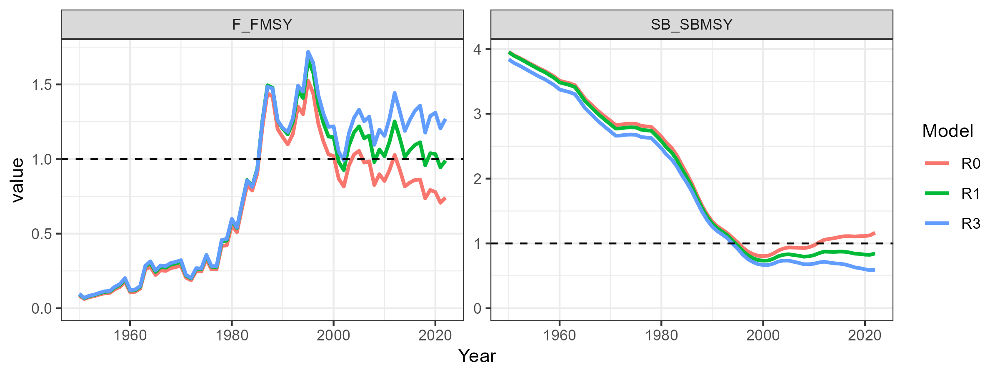
```

The MPs were provided with the observed historical indices (rather than the 'corrected' indices). The unaccounted 1% annual increase in catchability was assumed to continue in the projection period. This was done by assuming 1% annual positive observation error for the indices in the projection period (Figure \@ref(fig:r1-index)).

```{r r1-index, fig.cap='An example of the standardized biomass (blue) and the observed combined index (red) for R1, where an assumed 1 percent annual increase in catchability has not been accounted for in the standardization of the index.'}
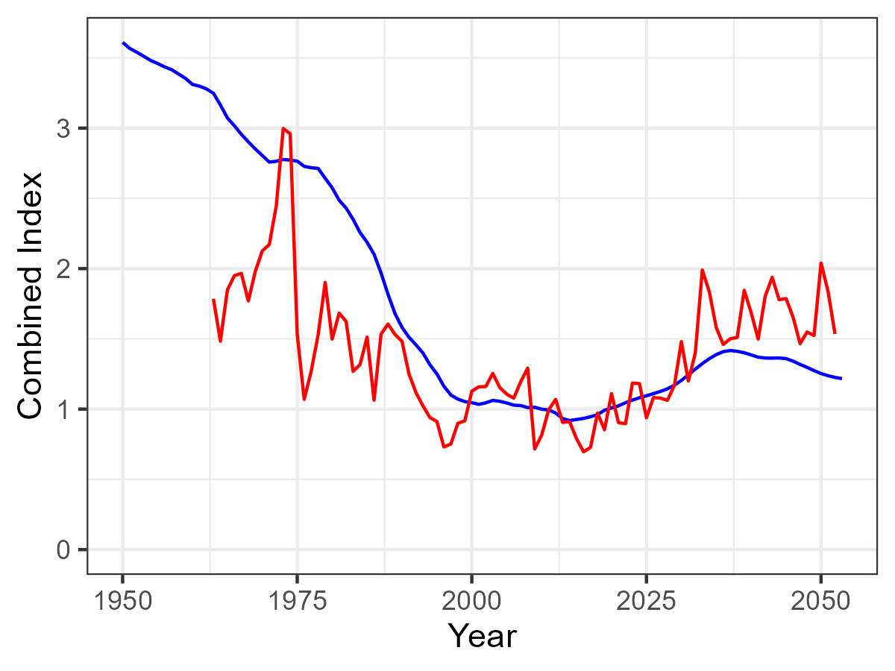
```

## R2. Hyperstable Indices in Historical Period

The R2 Robustness test is identical to R1 (Figure \@ref(fig:r1-compare)), except that the indices in the projection period are assumed to be proportional to the population; i.e., the 1% increase in catchability that was not accounted for the in the standardization of the historical indices no longer occurs in the projection period. 

## R3. Low initial spawning biomass

A robustness test to evaluate the ability of the CMPs to recover the stock from a low initial level. The historical indices were modified by adding a persistent slope such that the SB/SBMSY = 0.6 in the terminal year of the OM conditioning (Figure \@ref(fig:r1-compare)).


## R4 & R5. Effect of Climate Change on Recruitment Deviations in Projection Period

Climate change is generally predicted to increase temperatures throughout the Atlantic Ocean, which could have significant effects on swordfish recruitment. The Atlantic Multidecadal Oscillation (AMO) is an indicator of long-duration changes in the sea surface temperature of the North Atlantic Ocean. Thus, it could serve as the basis for possible future patterns in recruitment. This is not postulating that the AMO is in fact driving swordfish recruitment. Rather it is using the 32-year time series as a representative of actual oceanographic conditions and one possible pattern of a cyclical productivity that we wish to test the robustness of a CMP. In essence, these robustness tests are asking whether the CMP is robust to an extended period (~15 years) of negative recruitment deviations without a change in the underlying productivity of the stock.

The entire AMO long time series (1856-present) was considered and a 32-year period (1980-2011) was selected to represent a time series that contained an extended period of consecutive negative and consecutive positive deviations. The AMO values multiplied by an implied annual inflation factor of 2.0 to simulate the hypothesis that climate change could result in larger recruitment deviations in the future than in the past.

Two versions of this approach were developed. R4 uses the AMO values directly, with a period of lower than average recruitment for the first fifteen years, followed by a period of higher than average deviations (Figure \@ref(fig:r3) center panel). R5 considers the impact of just a period of negative recruitment deviations for the first fifteen years (Figure \@ref(fig:r3) right panel). 

In both cases (R4 and R5), the climate-induced pattern in recruitment deviations is multiplied by the recruitment deviations from the reference model (R0; Figure \@ref(fig:r3-2)). 

```{r r3, fig.cap='The cyclical (R4) and initial negative pattern (R5) in recruitment deviations for the robustness tests that investigate the impact of climate change on the performance of the CMPs. R0 is the reference model where no additional recruitment variabililty is added.'}
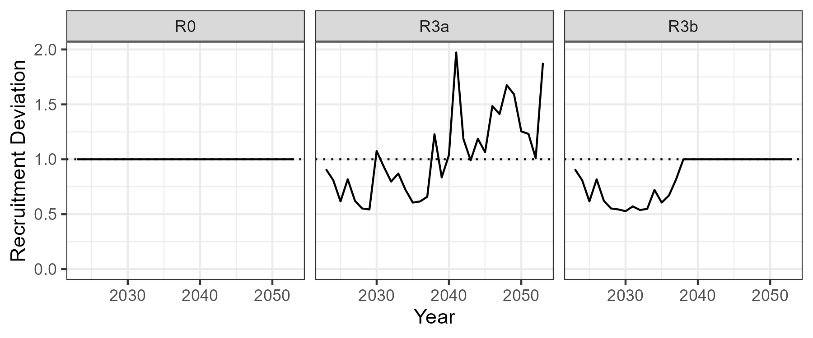
```

```{r r3-2, fig.cap='An example of the recruitment deviations from three simulations. R0 is the reference model (OM 5 from the Reference Set). R4 superimposes a cyclical pattern in recruitment deviations over those from R0. R5 superimposes negative recruitment deviations over those from R0 for the first fifteen years, before reverting back to the recruitment pattern used in R0.'}
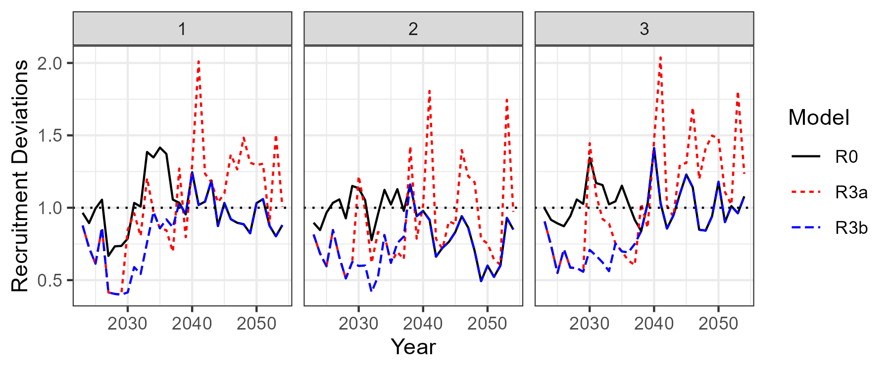
```

## R6. TAC Implementation Error

The R6 Robustness test evaluates the impact of a 10% implementation error in the TAC. The catches are assumed to be 10% higher than the TAC, but these catches are assumed to be unreported (i.e., the observed catches provided to the CMPs is equal to the TAC and ~90% of the actual landings).

## R7. Increased Observation Error in the Combined Index

The R7 Robustness tests aims to evaluate the impact on the performance of the CMPs when there is greater observation error in the Combined Index due to data from one or more fleets not being available when the index is updated.

This OM added additional multiplicative observation error to the Combined Index that was simulated in the projection years. The additional observation error was generated from a log-normal distribution with the standard deviation doubled from the base case (R0).

# OM Validation

## OM Summary Report

A [Summary Report](../Reports/OM_Summary/2024/OM_Summary_Report.html) summarizes the diagnostic checks, the calculated biological reference points, and the estimated stock status relative to those reference points, across the Reference and Robustness operating models.

## OM Diagnostic Reports

Individual diagnostic reports with objective function values and plots of model fits and patterns in residuals are available for each of the Reference and Robustness OMs (and the 2022 assessment) on the North Atlantic Swordfish MSE [homepage](https://iccat.github.io/nswo-mse/).


# Historical Spool-Up Period

The historical spool-up period was generated by importing the output from the SS3 assessment models and running the MSE simulation framework to recreate the historical fishery dynamics. No additional uncertainty was added to the historical simulations; that is, all $`r MOM@nsim`$ simulations were identical (e.g., same recruitment deviations) for the historical spool-up period.

The operating models have been conditioned on data up to and including 2022 (see the [OM Section](#om-conditioning)), and therefore the projection period for the MSE framework starts in the following year, i.e., 2023. 

Currently, model uses assumed catches for the first two years (2023 & 2024) and then implements the management procedures in the following year (i.e., 2025). See the [Future Catches](#future-catches) section for more information.

## Historical Data

The observed fishery data was imported into the MSE framework and made available to the CMPs. Three sources of data available to the CMPs: 1) catch data, 2) a primary index of abundance, and 3) additional individual indices.

### Catch Data

The catch data used in the OM conditioning are made available in the simulated data that is provided to the CMPs (Figure \@ref(fig:catch-plot)).

```{r catch-plot, fig.cap='The historical total catch and total allowable catch (TAC) for the North Atlantic swordfish.'}
knitr::include_graphics('../../img/Catch_TAC.png')
```


### Indices of Abundance

#### Primary Index

At the [2020 Swordfish MSE technical meeting (4 -- 5 June 2020)](../Meeting_Reports/2020_SWO_MSE_1_ENG.pdf), the Group chose to use the Combined Index [@ortiz2017] as the primary index for the development of CMPs. This index was updated for the 2022 assessment. The Combined Index was imported into the `SWOMSE` framework and made available to the CMPs (Figure \@ref(fig:index-plot)).

```{r index-plot, fig.cap='The Combined Index for the North Atlantic swordfish fishery.'}
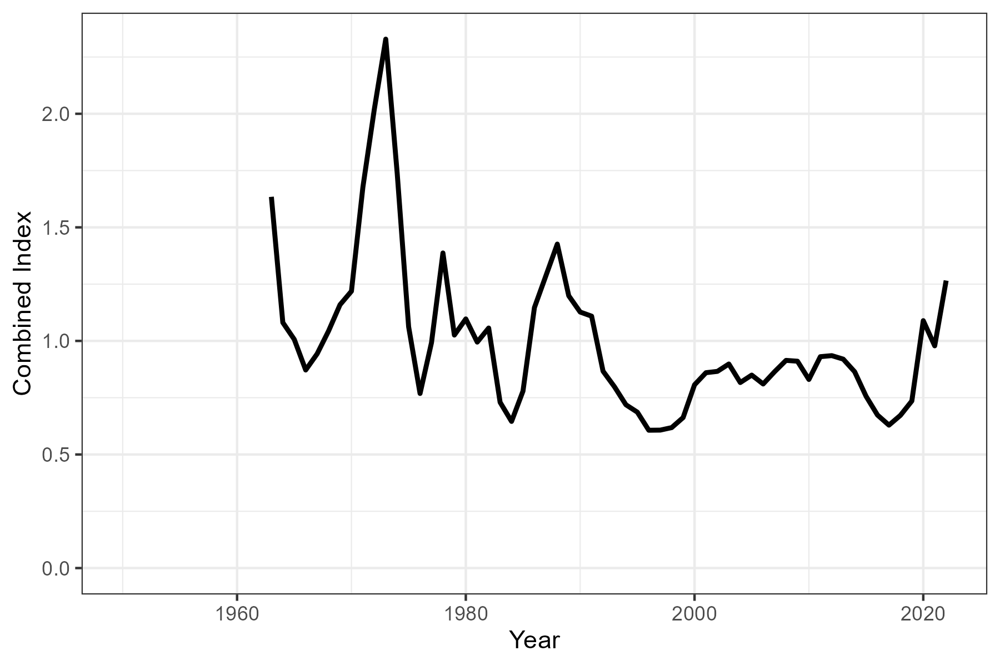
```

#### Other Indices

The additional individual fishery-dependent and survey indices are also imported into the MSE framework and made available to the CMPs (Figure \@ref(fig:addindex-plot)).


```{r addindex-plot, fig.cap='The additional individual fishery-dependent and survey indices for the North Atlantic swordfish fishery.', out.width = "800px"}
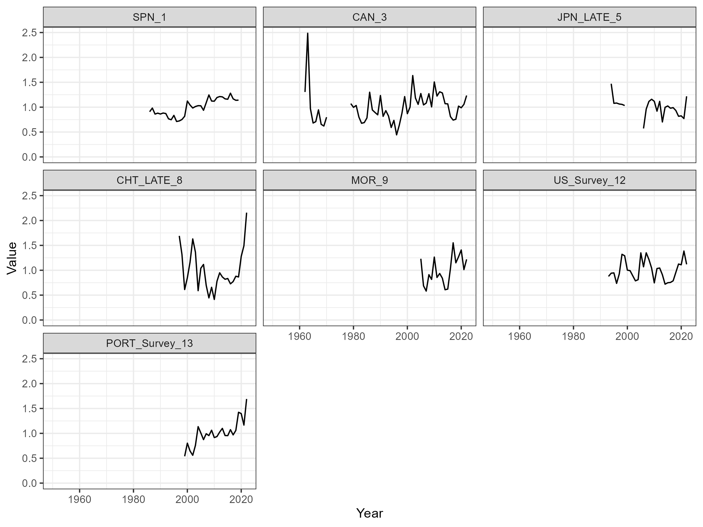
```


# Closed-Loop Simulation Testing

## Simulation Specifications

The current simulation specifications for the MSE are:

1.  Management interval: 3 (i.e., TAC updated every 3rd year)
2.  Number of projection years: 32 (2023 -- 2054)
3.  Number of simulations per OM: $`r MOM@nsim`$

## Assumptions

### Recruitment

The stock-recruitment relationship in the projection years was modeled using the Beverton-Holt function, with steepness fixed at the value assumed in the OM conditioning.

Recruitment deviations for the projection period were generated assuming a log-normal distribution with mean $\mu_R$ and variance $\sigma_R^2$, calculated as:

$$\mu_R = -0.5\sigma_R^2\left(1-\frac{\text{AC}}{\sqrt{(1-\text{AC}^2)}}\right)$$

where AC is the lag-1 autocorrelation factor calculated from the historical recruitment deviations and $\sigma_R^2$ is the variance of the recruitment deviations specified in the OM (i.e., sigmaR\^2 defined [above](#om-conditioning)).

The recruitment deviations for the projection period were generated independently for each simulation.

### Life-History

Biological parameters such as mean weight-at-age and maturity-at-age were constant for all years (historical and projection).

### Selectivity

Currently, the selectivity-at-length for the projection years is fixed to the estimated selectivity pattern from the last historical year for each OM. The reviewer of the `SWOMSE` R code highlighted this as a possible uncertainty and recommended that the Group consider testing alternative assumptions for the selectivity pattern in the projection years [@anon.2021].

### Catchability

No time-varying catchability is assumed for the projection years.

### Future Catches {#future-catches}

The total allowable catch (TAC) recommended by the CMPs is assumed to be implemented without error. That is, annual catches are equal to the TAC recommendations (provided sufficient vulnerable biomass was available). The Group determined that this assumption was appropriate based on the fact that historically the total landed catch has been below the total allowable catch (TAC) (see Figure \@ref(fig:catch-plot)).

A Robustness Test (R6) has been designed to evaluate the consequences of violating this assumption.

The CMPs are first implemented in 2025, and every 3rd year after that, with the TAC held constant in the interim years. Since the MSE projection period begins in 2023 (the year after the conditioning), the landed catches for 2023 and 2024 are fixed to the mean from 2013 -- 2022 (10,427 t).


## Generation of Future Data

### Indices

The primary index of abundance (Combined Index) was generated in the projection years by adding observation error to the projected stock biomass, and standardizing to be on the same scale as the historical observed Combined Index.

The additional individual indices were generated in the projection years in the same manner, using the simulated stock biomass (or abundance in some cases).

The observation error was generated by calculating the statistical properties of the residuals from the fit of each respective index to the simulated stock (biomass or abundance) during the historical period. The procedure for calculating the residuals for the projection years is described in detail in the [openMSE documentation](https://openmse.com/features-conditioning-oms/indices/).

It was decided at the 2023 Intersessional Meeting of the Swordfish Working Group to calculate the statistical properties of the observation error for the Combined Index for the years 1999 -- 2020. This period was chosen as it includes only the years where the data used to generate the index included the majority of the fleets. When the OMs were updated in 2024 with data up to 2022, the period for calculating the observation error was also updated to 1999 -- 2022.

Following the assumptions of the stock assessment, it is assumed that all indices are proportional to the respective stock biomass or abundance (i.e., it is assumed that the indices are not hyper-stable or hyper-deplete). The only exception to this is [Robustness OM 1](#r1) where the indices are assumed to have a 1% annual average increase in catchability.

### Catches

Following the assumption of the stock assessment, the observed catches in the projection years were generated with no observation error. That is, the observed catches in the MSE framework are equal to the actual simulated landed catches (provided there is sufficient biomass in the simulated population to support the prescribed TAC). The model does not include a bio-economic component and inter-annual change in fishing effort is unconstrained.

### Data Lags

In the MSE framework, the CMPs are always provided with the simulated fishery data up to the previous year. That is, if a CMP is implemented in year $t$, the catch and indices of abundance data provided to the CMP are up to and including year $t-1$.

Data lags are then handled in the CMP code, where the default assumption is that the catch and index data are lagged by 3 years from the year where the TAC will be implemented; e.g., for setting the TAC for 2025, the data is up to and including 2022. See the CMP (see the [CMP Development Guide](../cMPdevelopment/CMP-Development-Guide.html) for more details).

## Management Interval {#interval}

At the 2021 [Intersessional meeting](/Meeting_Reports/2021_SWO_ENG.pdf), the Group proposed a 3-year MP advice interval (see Table 5 in the [Report of the 2021 ICCAT Intersessional Meeting of the Swordfish Species Group](../Meeting_Reports//2021_SWO_ENG.pdf)).

The 3-yr management interval is applied within the CMP code (see the [CMP Development Guide](../cMPdevelopment/CMP-Development-Guide.html) for more details).


# Performance Metrics

```{r PMcalc, include=FALSE}
PMs <- suppressMessages(avail('PM', 'SWOMSE'))
ref <- OM_DF %>% filter(Class=='Reference')

```

`r length(PMs)` performance metrics (PMs) have been developed for the North Atlantic Swordfish MSE (Table \@ref(tab:PM-Description)). These PMs are grouped into four families:

1. **Status**: the probability the stock is in the green quadrant of the Kobe matrix

2. **Safety**: the probability of the stock not falling below the biological limit reference point

3. **Yield**: the TAC in the projection years (ton)

4. **Stability**: the variation in the TAC between management cycles

## Summary of Performance Metrics

The performance metrics are calculated over all the simulations (`r MOM@nsim`) in each operating model. For example, *PGK_short* is calculated as the proportion of the `r MOM@nsim` simulations where the spawning biomass ($SB$) is above $SB_{MSY}$ and fishing mortality ($F$) is below $F_{MSY}$. 

The performance metrics can also be calculated over several operating models, for example the entire [Reference Set](#reference_models). This is done by first combining the MSE results for each OM (e.g., the `r nrow(ref)` Reference OMs) into a single set of results (in this example, resulting in `r nrow(ref)*MOM@nsim` simulations (`r nrow(ref)` OMs multiplied by `r MOM@nsim` simulations per OM)), and then calculating the performance metrics over all results. 

The Minimum Acceptable Performance values listed in Table \@ref(tab:PM-Description) will be used as alternative values to determine if candidate management procedures meet the minimum performance criteria. 

More details on the individual performance metrics are in the sections below.

```{r PM-Description}

caption <- 'Summary of the North Atlantic Swordfish Performance Metrics.'

PM_desc <- PM_desc %>% filter(Name!='PGK_6_10')

PM_desc %>% knitr::kable(escape = T,
                         caption=caption,
                         booktabs=TRUE) %>%
  kableExtra::kable_styling("striped", full_width = T) %>%
  kableExtra::column_spec(1, bold=T)

```

```{r loadMSEs, cache=FALSE, include=FALSE}
mselist <- readRDS('../../dev/PM_dev.mse')
MSE_all <- combine_MMSE(mselist, 'Reference OMs')

MSE_1 <- mselist[[1]]
MSE_2 <- mselist[[2]]
MSE_3 <- mselist[[3]]
MSE_4 <- mselist[[4]]
MSE_5 <- mselist[[5]]
MSE_6 <- mselist[[6]]

PMlist <- readRDS('../../dev/PMlist.rda')

for (i in 1:length(PMlist)) {
  if (is.numeric(PMlist[[i]]))
    PMlist[[i]] <- round(PMlist[[i]],2)
}

```

## Peformance Metrics Examples

The following sections show figures and statistics for examples from each family of Performance Metrics. These results include two example candidate management procedures (`r PMlist$MPs`) (see [Candidate Management Procedures](#CMPs)), with a single operating model that includes `r MSE_1@nsim` stochastic simulations. 

### Summary Table 

Table \@ref(tab:PMtable) shows the summary performance statistics for the example CMPs. More details for each individual performance metric are in the sub-sections below.

```{r PMtable}

caption <- 'Summary of Performance Metric values for some example CMPs.'

PM_df <- do.call('rbind', PMlist)
colnames(PM_df) <- PMlist$MPs
PM_df <- PM_df[1:(nrow(PM_df)-1),]

PM_df <- PM_df %>% data.frame() %>%
  mutate_at(c(1,2), as.numeric) %>%
  mutate_at(c(1,2), round, 2)

PM_df$Name <- rownames(PM_df)

PM_table <- left_join(PM_desc, PM_df, by = join_by(Name))
PM_table$`Minimum Acceptable Values` <- NULL
PM_table <- PM_table %>% na.exclude()

rownames(PM_table) <- NULL
PM_table %>% knitr::kable(escape = T,
                          caption=caption,
                          booktabs=TRUE) %>%
  kableExtra::kable_styling("striped", full_width = T) %>%
  kableExtra::column_spec(1, bold=T)


```

## Status

### PGK_short

`PGK_short` calculates the probability of being in Green Zone of Kobe Space (SB>SBMSY & F<FMSY) in years 1-10 (2025-2034). This is calculated as the proportion of the total number of simulations that are in the Green Zone of Kobe Space in those years.

Figure \@ref(fig:PGKshort) shows an example of two CMPs (`r PMlist$MPs`) for an operating model with `r MSE_1@nsim` simulations. The values for `PGK_short` in this example are: `r PMlist$PGK_short`.

```{r PGKshort, fig.cap='An example of time-series plots of F/FMSY and SB/SBMSY for two CMPs. This OM has 10 simulations, shown as the colored lines. Simulations where SB>SBMSY and F<FMSY are indicated with a green point, and those outside of the green space in the Kobe plot are indicated in red. The Kobe plot on the bottom shows these points in the Kobe space. The numbers in the corners indicate the percent of points in each area of the Kobe space.', out.width = "800px"}
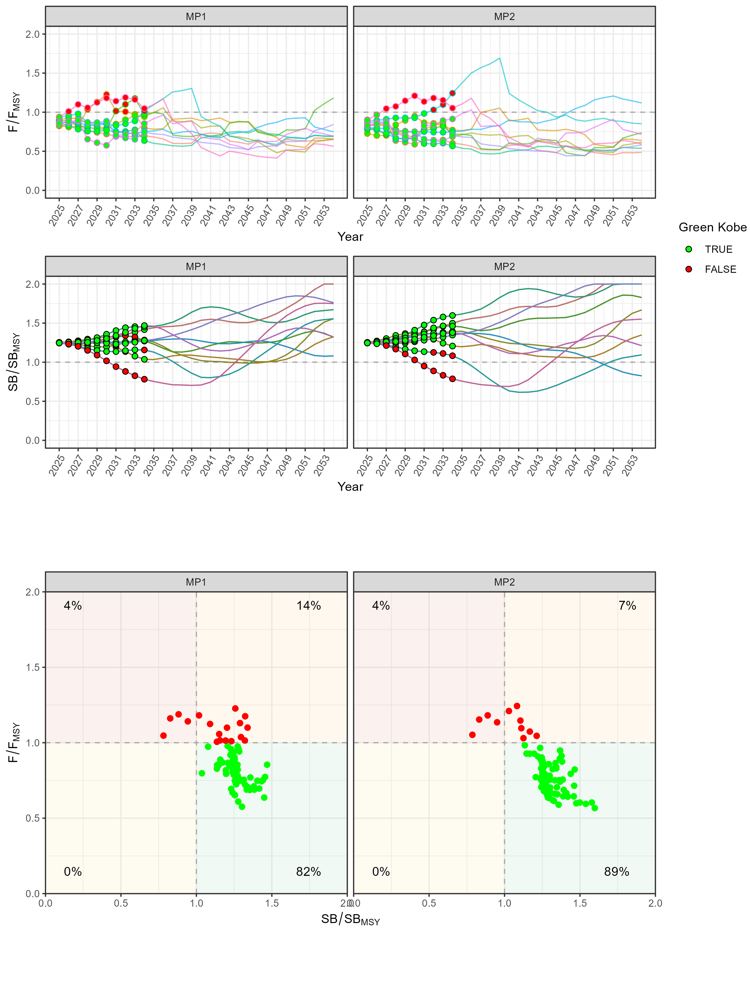
```


### PGK_med

`PGK_med` calculates the probability of being in Green Zone of Kobe Space (SB>SBMSY & F<FMSY) over years 11--20 (2035--2044). This is calculated as the proportion of the total points (number of simulations x number of years) that are in the Green Zone of Kobe Space.

Figure \@ref(fig:PGKmed) shows an example of two CMPs (`r PMlist$MPs`) for an operating model with `r MSE_1@nsim` simulations. The values for `PGK_med` in this example are: `r PMlist$PGK_med`.

```{r PGKmed, fig.cap='An example of time-series plots of F/FMSY and SB/SBMSY for two CMPs. This OM has 10 simulations, shown as the colored lines. Simulations where SB>SBMSY and F<FMSY are indicated with a green point, and those outside of the green space in the Kobe plot are indicated in red. The Kobe plot on the bottom shows these points in the Kobe space. The numbers in the corners indicate the percent of points in each area of the Kobe space.', out.width = "800px"}
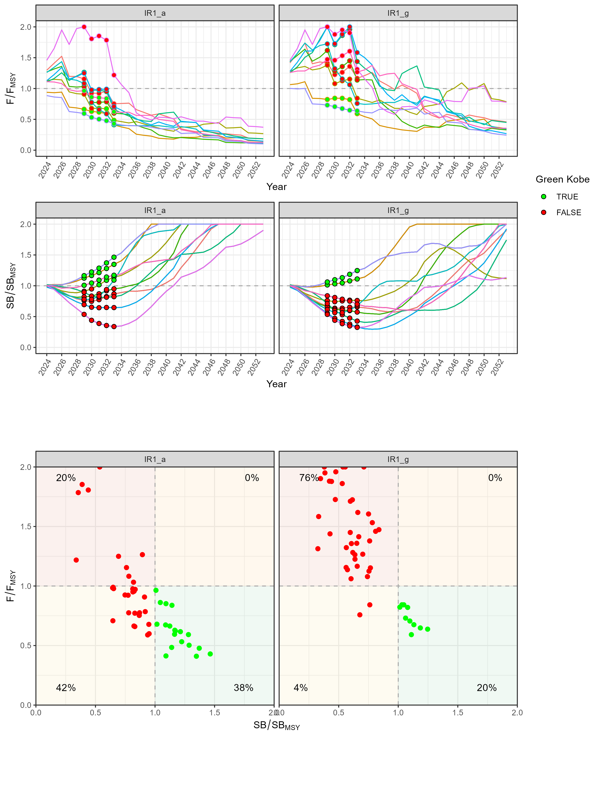
```


### PGK_long

`PGK_long` calculates the probability of being in Green Zone of Kobe Space (SB>SBMSY & F<FMSY) over years 21--30 (2045--2054). This is calculated as the proportion of the total points (number of simulations x number of years) that are in the Green Zone of Kobe Space.

Figure \@ref(fig:PGKlong) shows an example of two CMPs (`r PMlist$MPs`) for an operating model with `r MSE_1@nsim` simulations. The values for `PGK_long` in this example are: `r PMlist$PGK_long`.

```{r PGKlong, fig.cap='An example of time-series plots of F/FMSY and SB/SBMSY for two CMPs. This OM has 10 simulations, shown as the colored lines. Simulations where SB>SBMSY and F<FMSY are indicated with a green point, and those outside of the green space in the Kobe plot are indicated in red. The Kobe plot on the bottom shows these points in the Kobe space. The numbers in the corners indicate the percent of points in each area of the Kobe space.', out.width = "800px"}
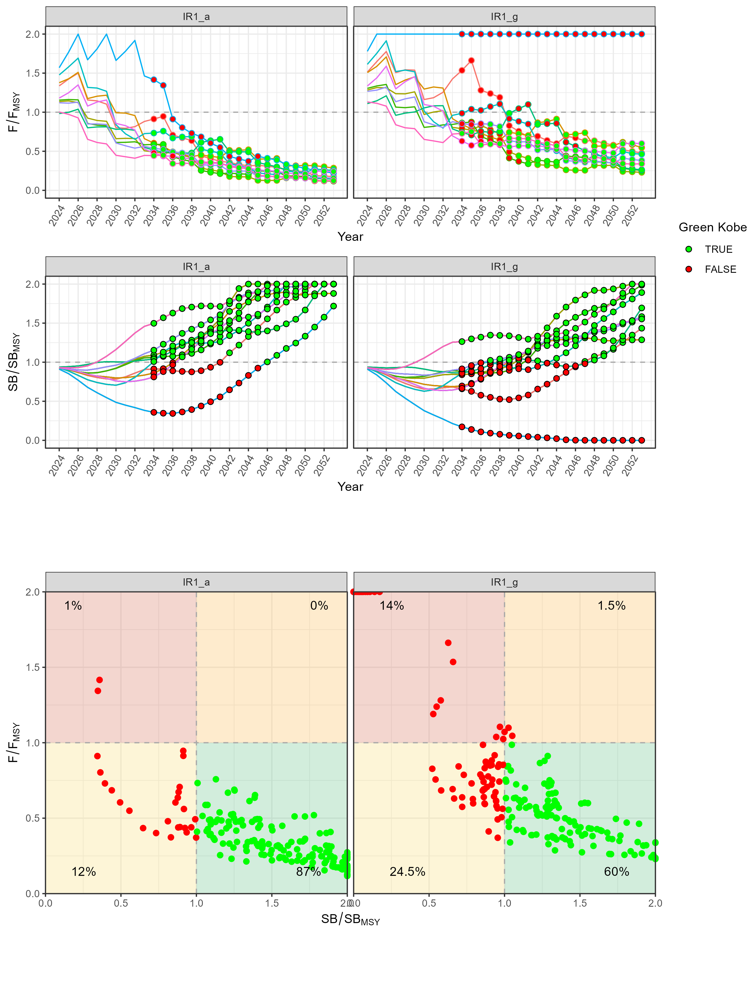
```


### PGK

`PGK` calculates the probability of being in Green Zone of Kobe Space (SB>SBMSY & F<FMSY) over all years (2025--2054). This is calculated as the proportion of the total points (number of simulations x number of years) that are in the Green Zone of Kobe Space.

Figure \@ref(fig:PGK) shows an example of two CMPs (`r PMlist$MPs`) for an operating model with `r MSE_1@nsim` simulations. The values for `PGK` in this example are: `r PMlist[['PGK']]`.

```{r PGK, fig.cap='An example of time-series plots of F/FMSY and SB/SBMSY for two CMPs. This OM has 10 simulations, shown as the colored lines. Simulations where SB>SBMSY and F<FMSY are indicated with a green point, and those outside of the green space in the Kobe plot are indicated in red. The Kobe plot on the bottom shows these points in the Kobe space. The numbers in the corners indicate the percent of points in each area of the Kobe space.', out.width = "800px"}
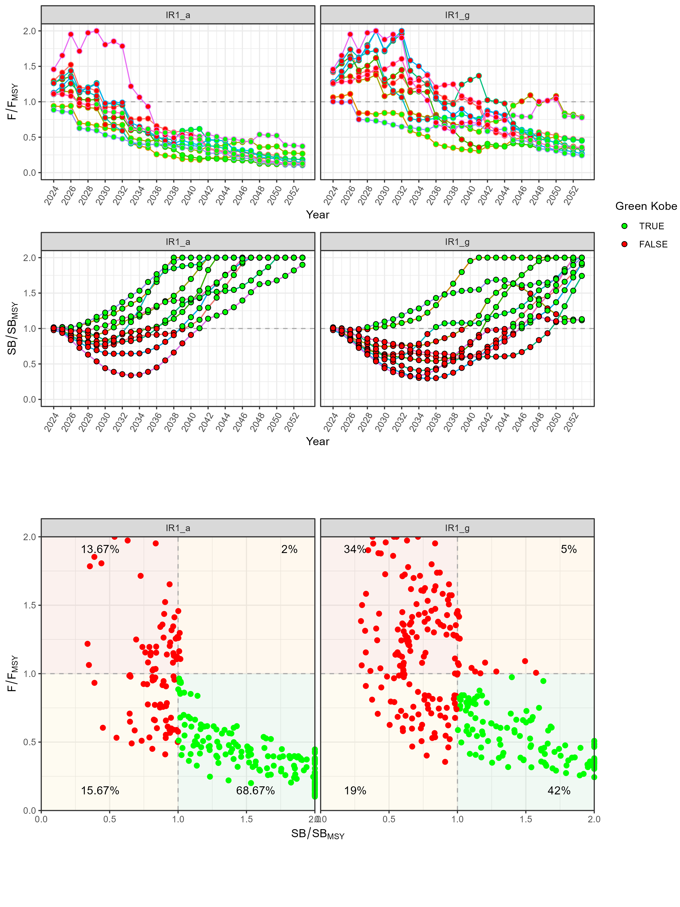
```


### PGK_30

`PGK_30` calculates the probability of being in Green Zone of Kobe Space (SB>SBMSY & F<FMSY) in year (2054). This is calculated as the proportion of the total number of simulations that are in the Green Zone of Kobe Space.

Figure \@ref(fig:PGK30) shows an example of two CMPs (`r PMlist$MPs`) for an operating model with `r MSE_1@nsim` simulations. The values for `PGK_30` in this example are: `r PMlist$PGK_30`.

```{r PGK30, fig.cap='An example of time-series plots of F/FMSY and SB/SBMSY for two CMPs. This OM has 10 simulations, shown as the colored lines. Simulations where SB>SBMSY and F<FMSY are indicated with a green point, and those outside of the green space in the Kobe plot are indicated in red. The Kobe plot on the bottom shows these points in the Kobe space. The numbers in the corners indicate the percent of points in each area of the Kobe space.', out.width = "800px"}
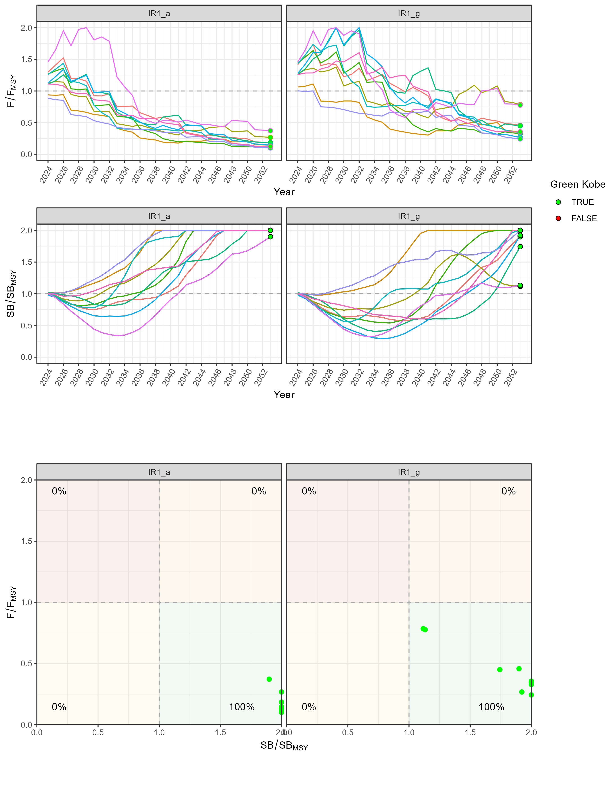
```

### POF and PNOF

`POF` calculates the probability of over-fishing (F>FMSY) over all years (2025--2054). This is calculated as the proportion of the total number of points (number of simulations x number of years) where F is greater than FMSY.

Figure \@ref(fig:POF) shows an example of two CMPs (`r PMlist$MPs`) for an operating model with `r MSE_1@nsim` simulations. The values for `POF` in this example are: `r PMlist$POF`.

`PNOF` reports the probability of not overfishing, calculated as $1-\text{POF}$, i.e. `r 1-PMlist$POF`.

```{r POF, fig.cap='An example of a time-series plot of F/FMSY for a two CMPs. This OM has 10 simulations, shown as the colored lines. Simulations where F<FMSY are indicated with a green point, and red points indicate F>FMSY. The Kobe plot on the bottom shows these points in the Kobe space. The numbers in the corners indicate the percent of points in each area of the Kobe space.', out.width = "800px"}
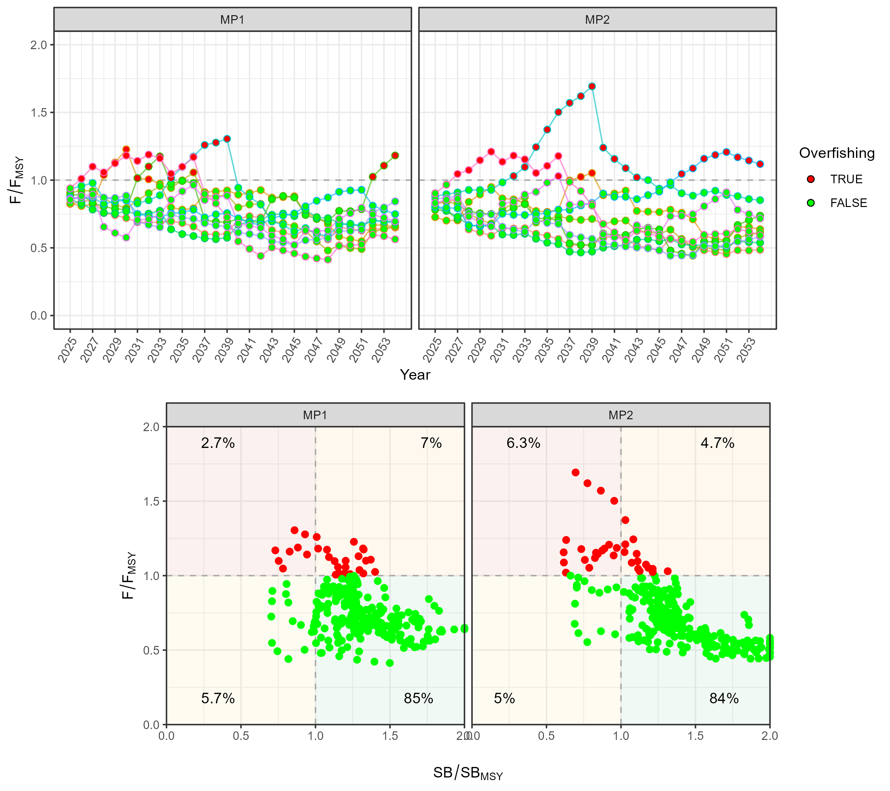
```


## Safety

### LRP_short 

`LRP_short` calculates the probability of breaching the limit reference point (LRP; SB<0.4SBMSY) in any of the first 10 years (2025-2034). 

This is calculated as the proportion of simulations where SB<0.4SBMSY in any of the first 10 years.

Figure \@ref(fig:LRPshort) shows an example of two CMPs (`r PMlist$MPs`) for an operating model with `r MSE_1@nsim` simulations. The values for `LRP_short` in this example are: `r PMlist$LRP_short`.

```{r LRPshort, fig.cap='An example of a time-series plot of SB/SBMSY for a two CMPs. This OM has 10 simulations, shown as the colored lines. Simulations where SB>0.4SBMSY are indicated with a green point, and red points indicate SB<0.4SBMSY. The Kobe plot on the bottom shows these points in the Kobe space. The numbers in the corners indicate the percent of points in each area of the Kobe space.', out.width = "800px"}
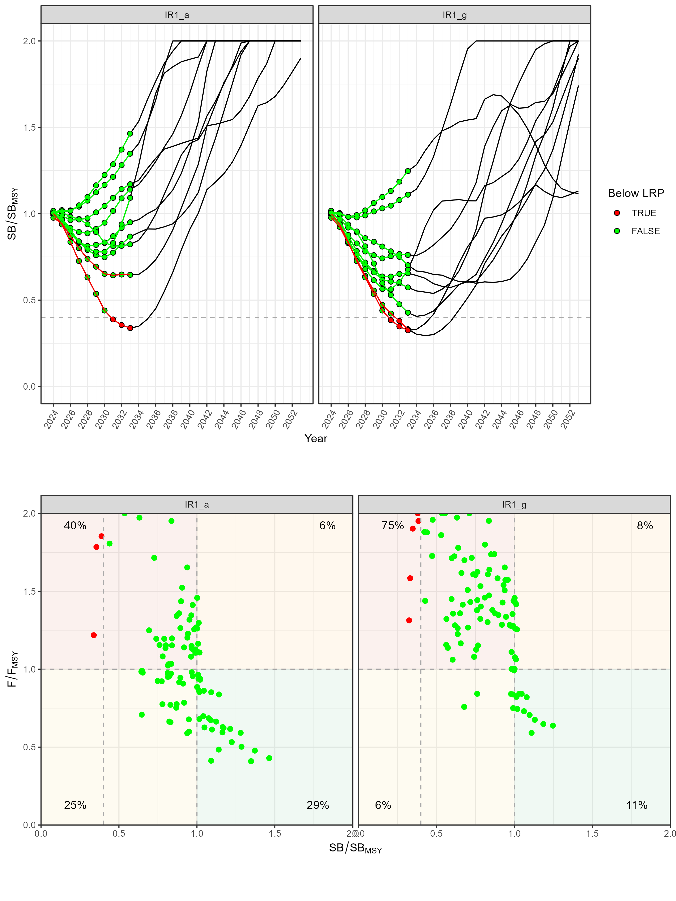
```


### LRP_med 

`LRP_med` calculates the probability of breaching the limit reference point (LRP; SB<0.4SBMSY) in any of years 11-20 (2035-2044). 

This is calculated as the proportion of simulations where SB<0.4SBMSY in any of years 11-20.

Figure \@ref(fig:LRP-med) shows an example of two CMPs (`r PMlist$MPs`) for an operating model with `r MSE_1@nsim` simulations. The values for `LRP_med` in this example are: `r PMlist$LRP_med`.

```{r LRP-med, fig.cap='An example of a time-series plot of SB/SBMSY for a two CMPs. This OM has 10 simulations, shown as the colored lines. Simulations where SB>0.4SBMSY are indicated with a green point, and red points indicate SB<0.4SBMSY. The Kobe plot on the bottom shows these points in the Kobe space. The numbers in the corners indicate the percent of points in each area of the Kobe space.', out.width = "800px"}
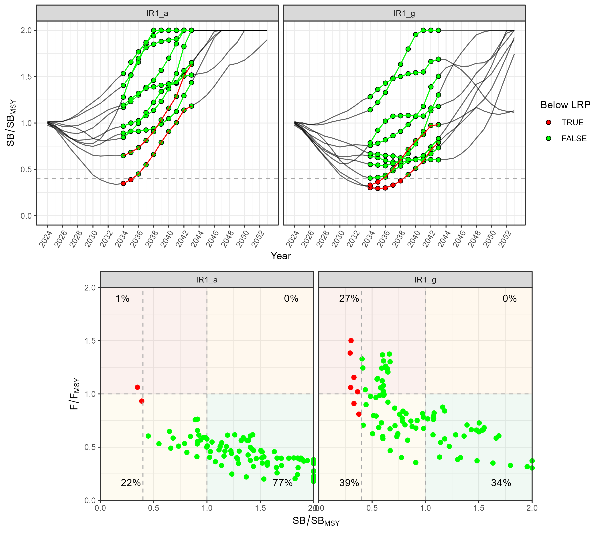
```


### LRP_long 

`LRP_long` calculates the probability of breaching the limit reference point (LRP; SB<0.4SBMSY) in any of years 21-30 (2045-2054).

This is calculated as the proportion of simulations where SB<0.4SBMSY in any of the last 10 years.

Figure \@ref(fig:LRP-long) shows an example of two CMPs (`r PMlist$MPs`) for an operating model with `r MSE_1@nsim` simulations. The value for `LRP_long` in this example are: `r PMlist$LRP_long`.

```{r LRP-long, fig.cap='An example of a time-series plot of SB/SBMSY for two CMPs. This OM has 10 simulations, shown as the colored lines. Simulations where SB>0.4SBMSY are indicated with a green point, and red points indicate SB<0.4SBMSY. The Kobe plot on the bottom shows these points in the Kobe space. The numbers in the corners indicate the percent of points in each area of the Kobe space.', out.width = "800px"}
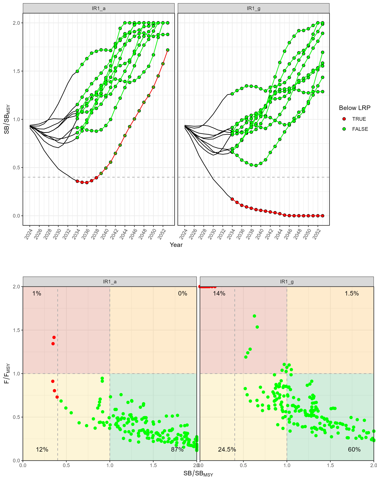
```

### LRP 

`LRP` calculates the probability of breaching the limit reference point (LRP; SB<0.4SBMSY) in any of the projection years (2025-2054).

This is calculated as the proportion of simulations where SB<0.4SBMSY in any year.

Figure \@ref(fig:LRP) shows an example of two CMPs (`r PMlist$MPs`) for an operating model with `r MSE_1@nsim` simulations. The value for `LRP` in this example are: `r PMlist$LRP`.

```{r LRP, fig.cap='An example of a time-series plot of SB/SBMSY for a two CMPs. This OM has 10 simulations, shown as the colored lines. Simulations where SB>0.4SBMSY are indicated with a green point, and red points indicate SB<0.4SBMSY. The Kobe plot on the bottom shows these points in the Kobe space. The numbers in the corners indicate the percent of points in each area of the Kobe space.', out.width = "800px"}
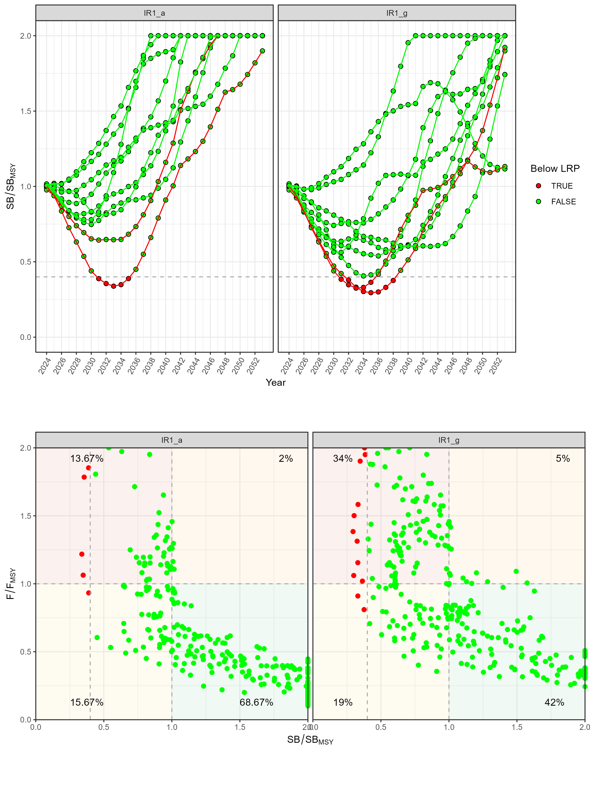
```


## Yield

### TAC1

`TAC1` calculates the median TAC (t) in the first year (2025). This is calculated as the median across the simulations of the 2025 TAC.  

Figure \@ref(fig:C1) shows an example of two CMPs (`r PMlist$MPs`) for an operating model with `r MSE_1@nsim` simulations. The values for `TAC1` in this example are: `r round(PMlist$TAC1,0)`.

```{r C1, fig.cap='An example of time-series plots of the TAC for two CMPs. This OM has 10 simulations, shown as the colored lines. The points indicate the values used to calculate the median value.', out.width = "800px"}
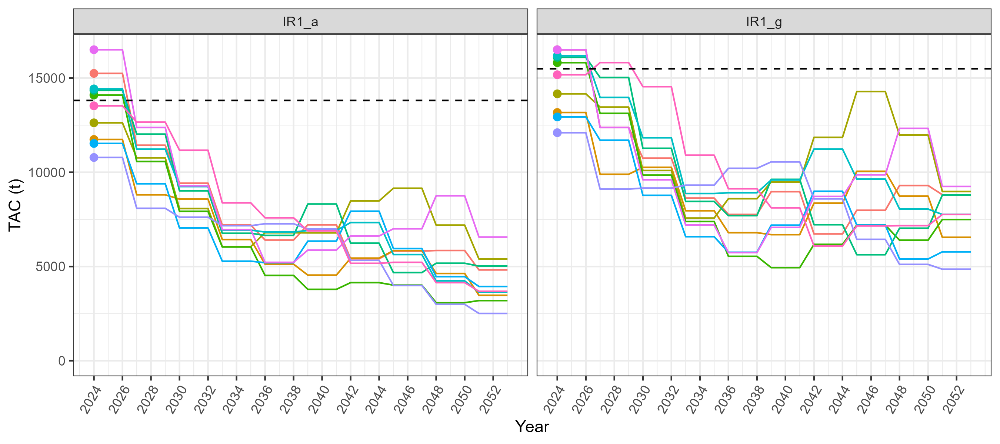
```

### AvTAC_short

`AvTAC_short` calculates the median TAC (t) in the first 10 years (2025--2034). This is calculated as the median TAC across the simulations and years. 

Figure \@ref(fig:AvC10) shows an example of two CMPs (`r PMlist$MPs`) for an operating model with `r MSE_1@nsim` simulations. The values for `AvTAC_short` in this example are: `r round(PMlist$AvTAC_short,0)`.

```{r AvC10, fig.cap='An example of time-series plots of the TAC for a two CMPs. This OM has 10 simulations, shown as the colored lines. The points indicate the values used to calculate the median value.', out.width = "800px"}
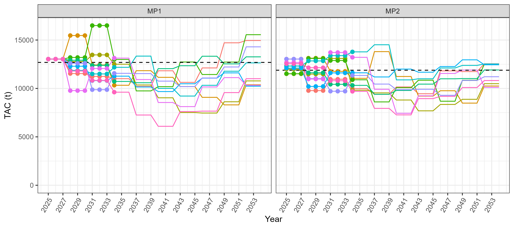
```


### AvTAC_med

`AvTAC_med` calculates the median TAC (t) in years 11 -- 20 (2035--2044). This is calculated as the median TAC across the simulations and years. 

Figure \@ref(fig:AvCmed) shows an example of two CMPs (`r PMlist$MPs`) for an operating model with `r MSE_1@nsim` simulations. The values for `AvTAC_med` in this example are: `r round(PMlist$AvTAC_med,0)`.

```{r AvCmed, fig.cap='An example of time-series plots of the TAC for a two CMPs. This OM has 10 simulations, shown as the colored lines. The points indicate the values used to calculate the median value.', out.width = "800px"}
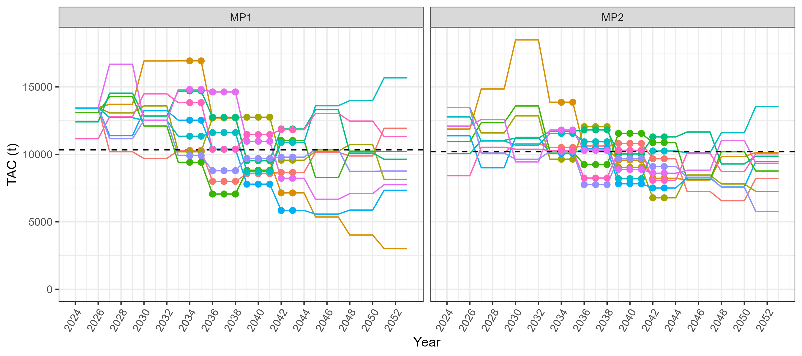
```


### AvTAC_long

`AvTAC_long` calculates the median TAC (t) in the last 10 years (2045--2054). This is calculated as the median TAC across the simulations and years. 

Figure \@ref(fig:AvC30) shows an example of two CMPs (`r PMlist$MPs`) for an operating model with `r MSE_1@nsim` simulations. The values for `AvTAC_long` in this example are: `r round(PMlist$AvTAC_long,0)`.

```{r AvC30, fig.cap='An example of time-series plots of the TAC for a two CMPs. This OM has 10 simulations, shown as the colored lines. The points indicate the values used to calculate the median value.', out.width = "800px"}
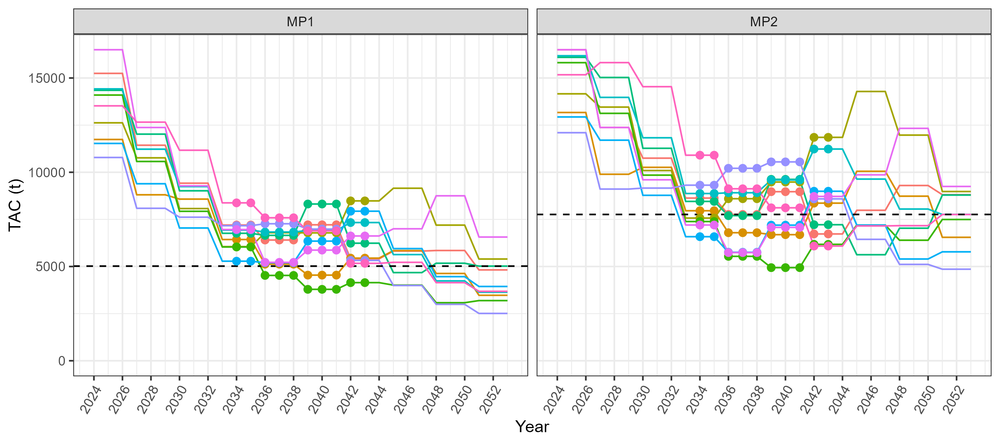
```

## Stability 

### VarC

`VarC` calculates the mean absolute change in the TAC between management cycles, calculated across all years and simulations.

Figure \@ref(fig:VarC) shows an example of two CMPs (`r PMlist$MPs`) for an operating model with `r MSE_1@nsim` simulations. The values for `VarC` in this example are: `r PMlist$VarC`. 

```{r VarC, fig.cap='Violin plots of the relative absolute change in the TAC between management cycles for two CMPs.', out.width = "800px"}
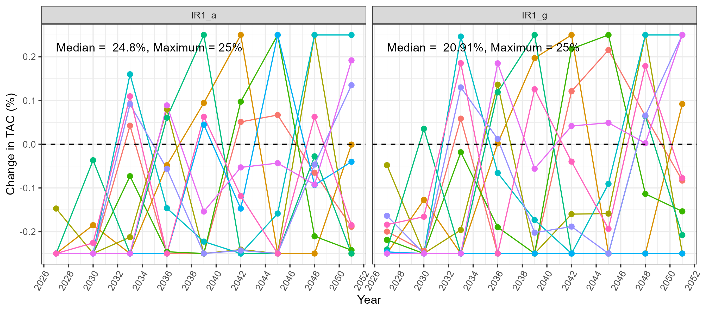
```


# Candidate Management Procedures {#CMPs}

## Tuning of Candidate Management Procedures {#tuning}

```{r, echo=FALSE}
PM_tuning <- read.csv('../../build_package/Tuning_Target_Codes.csv')

```

During development, the Candidate Management Procedures are tuned to achieve specific performance outcomes. These performance outcomes are calculated across all the Reference OMs; i.e, the MSE results from each Reference OM are aggregated together. `r nrow(PM_tuning)` different tuning targets have been specified (Table \@ref(tab:PM-tuning)). 

There will be `r nrow(PM_tuning)` versions of each CMP corresponding to metrics and targets described in Table \@ref(tab:PM-tuning). The names of the CMPs include the tuning code (i.e., 'a', 'b').

```{r PM-tuning}

caption <- 'The codes, metrics, and targets used for the tuning of the CMPs.'

PM_tuning %>% knitr::kable(escape = F,
                    caption=caption,
                    booktabs=TRUE) %>%
  kableExtra::kable_styling("striped", full_width = T)

```

<!-- ## Overview of Candidate Management Procedures -->

```{r MPoverview, results="asis"}

# caption <- 'Summary of the Candidate Management Procedures.'
# 
# CMP_DF <- readRDS('../../dev/MP_description.rda')
# CMP_DF$Author <- NULL
# 
# 
# CMP_DF %>% knitr::kable(escape = F,
#                     caption=caption,
#                     booktabs=TRUE) %>%
#   kableExtra::kable_styling("striped", full_width = T)

```

<!-- All MPs are subject to a constraint on the maximum absolute change in TAC between management cycles. -->

<!-- ## Surplus Production (SP) -->

<!-- ### SP -->

<!-- A Schaefer surplus production model (`SAMtool::SP`) is fitted to the Combined Index and the catch data. The TAC is set according to a harvest control rule (HCR) based on the HCR developed for the [North Atlantic Albacore](https://www.iccat.int/Documents/Recs/compendiopdf-e/2021-04-e.pdf). -->

<!-- $$ -->
<!-- F_\text{set} =  -->
<!-- \begin{cases} -->
<!--     F_\text{targ} & \text{if } B_\text{curr} \geq B_\text{thresh} \\ -->
<!--     F_\text{targ} (-0.367 + 1.167 \frac{B_\text{curr}}{ B_\text{thresh}}) & \text{if }  B_\text{lim} < B_\text{curr} < B_\text{thresh} \\ -->
<!--     F_\text{min}  & \text{otherwise} -->
<!-- \end{cases} -->
<!--   (\#eq:SP1) -->
<!-- $$ -->

<!-- where $B_\text{curr}$ and $B_\text{thresh}$ are current biomass and $B_\text{MSY}$ estimated by the assessment model, $B_\text{lim}$ is $0.4B_\text{thresh}$, and  $F_\text{targ}$ and $F_\text{min}$ are $\delta 0.8 F_\text{MSY}$ and $\delta 0.1 F_\text{MSY}$ respectively, where $F_\text{MSY}$ is estimated by the assessment model, and $\delta$ is a tuning parameter (see Table \@ref(tab:PM-tuning)).  -->

<!-- The TAC is then calculated as: -->
<!-- $$ -->
<!-- \text{TAC} = \frac{F_\text{set}}{Z}(1-e^{-Z}) B_\text{curr} -->
<!-- $$ -->
<!-- where $Z = 0.2 +F_\text{set}$.  -->

<!-- ### SPFox  -->

<!-- A Fox production model (`SAMtool::SP_Fox`) is used together with the HCR described for `SP1`. -->


<!-- ## Index Ratio  (IR) -->

<!-- ### IR1 -->

<!-- Iteratively adjusts the TAC in each management cycle $(m)$ based on the ratio of the mean Combined Index $(I)$ over the last 3 years to the mean Combined Index over the 3 previous years:  -->

<!-- \begin{equation}  -->
<!--   \text{TAC}_{m} = \text{TAC}_{m-1} \delta I_{\text{rat}}  -->
<!--   (\#eq:IR1) -->
<!-- \end{equation}  -->

<!-- where $\delta$ is a tuning parameter (see Table \@ref(tab:PM-tuning)) and $I_{\text{rat}} = \frac{\bar{I}_{[y-2:y]}}{\bar{I}_{[y-5:y-3]}}$.  -->


<!-- ### IR2 -->

<!-- Same as `IR1` except that the index ratio is calculated over the last 2 and the previous 2 years before that: -->

<!-- \begin{equation}  -->
<!--  I_{\text{rat}} = \frac{\bar{I}_{[y-1:y]}}{\bar{I}_{[y-3:y-2]}}  -->
<!--   (\#eq:IR2) -->
<!-- \end{equation}  -->


<!-- ## Constant Exploitation (CE) -->

<!-- ### CE  -->

<!-- This MP aims to keep the exploitation rate at a constant level. The current relative exploitation rate is calculated as the mean of the catches from 2016 -- 2020 divided by the mean Combined Index over this same period. -->

<!-- $$  -->
<!--   \text{TAC}_{m} = \delta \text{TAC}_{m-1}  E_{\text{rat}}  -->
<!--   (\#eq:CE) -->
<!-- $$ -->

<!-- $$ -->
<!-- E_{\text{rat}} = \frac{\text{ER}_\text{hist}}{\text{ER}_\text{curr}} -->
<!-- (\#eq:Erat) -->
<!-- $$ -->
<!-- $$ -->
<!-- \text{ER}_\text{hist} = \frac{\bar{C}_{2016-2020}}{\bar{I}_{2016-2020}} -->
<!-- (\#eq:Ehist) -->
<!-- $$ -->
<!-- $$ -->
<!-- \text{ER}_\text{curr} = \frac{\bar{C}_{y-2:y}}{\bar{I}_{y-2:y}} -->
<!-- (\#eq:Ecurr) -->
<!-- $$ -->


# Reporting of MSE Results

## Interactive Application 

The current MSE results are available in an [Interactive Application](https://shiny.bluematterscience.com/app/swomse)


# References
