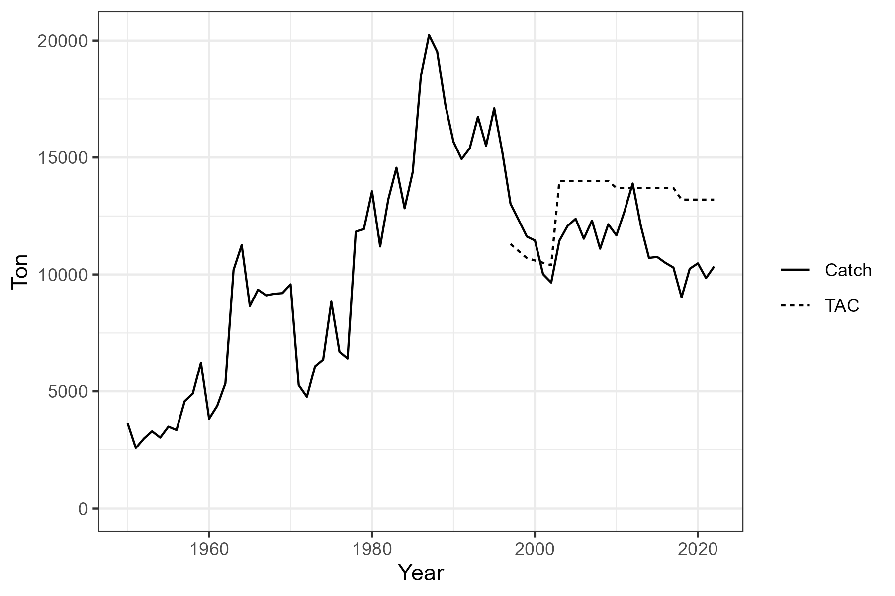

```{css, echo=FALSE}
.csl-entry {
    margin-bottom: 12px;
}
```

```{r, include=FALSE}
library(SWOMSE)
knitr::opts_chunk$set(echo=TRUE)
```

# Introduction
This document is a quick start user guide to using the `SWOMSE` package to conduct management strategy evaluation (MSE) for the North Atlantic swordfish fishery (hereafter swordfish).

A description of the specifications for the MSE is available in [MSE Trial Specifications Document](../TS/Trial_Specs.html). Other material relating to the operating models (OMs) and MSE is available on the [Swordfish MSE homepage](https://iccat.github.io/nswo-mse/).  

# Required Software

## R Software Environment 
The `SWOMSE` framework requires the latest version of the R software installed on your system.  The R software can be downloaded for Linux, Mac OS X, and Windows from [here](https://cloud.r-project.org/). 

This manual assumes readers are familiar with the R programming language.

We also recommend the latest version of [RStudio](https://rstudio.com/products/rstudio/download/#download).

## SWOMSE R Package
The MSE code is packaged into an R package called `SWOMSE`, stored in the [ICCAT/nswo-mse GitHub Repository](https://github.com/ICCAT/nswo-mse). 

The `remotes` package is required to install the `SWOMSE` package from GitHub. Install the `remotes` package with:

```{r, eval=FALSE}
install.packages('remotes')
```

Then the `SWOMSE` package can be installed with:

```{r, eval=FALSE}
remotes::install_github("ICCAT/nswo-mse")
```

This will install the `SWOMSE` package and all the dependency packages on your machine.

Alternatively, you can clone the repository on your machine and build and install the package locally with RStudio.

Once installed, the package can be loaded into the current R session:

```{r}
library(SWOMSE)
```

### About the `openMSE` R Package
The `SWOMSE` package uses the `openMSE` package as a key dependency. `openMSE` will be automatically installed when the `SWOMSE` package is installed.

`openMSE` is an umbrella R package for:

* [`MSEtool`](https://cran.r-project.org/package=MSEtool): an R package developed for conducting fast, flexible, and transparent, MSE for a wide range of fisheries;
* [`DLMtool`](https://cran.r-project.org/package=DLMtool): an R package containing 100+ data-limited management procedures;
* [`SAMtool`](https://cran.r-project.org/package=SAMtool): an R package containing data-moderate and data-rich stock assessments and operating model conditioning functions.

All functions related to importing operating models, simulating the historical fishery dynamics, and projecting the fishery forward in time with different modes of management are located in the `MSEtool` package, and are available to the user when the `SWOMSE` package is loaded. 

A non-technical description of `openMSE` and its key features is available on the [`openMSE` website](https://openmse.com/). The operating model in `MSEtool`, including assumptions and equations, is described in detail in @carruthersDataLimitedMethodsToolkit2018.


# Operating Models

```{r message=FALSE, warning=FALSE, include=FALSE}
MOMs <- avail('MOM', 'SWOMSE')
global <- avail('MOM')
MOMs <- MOMs[!MOMs%in%global]

```

The `SWOMSE` package contains all the operating models (OMs) that have been generated for the swordfish MSE. The operating models are objects of class `MOM` (multi-stock operating models), and are structured to include 2-sexes (female and male) and one overall fishing fleet (aggregated exploitation pattern of the individual fleets).

Currently, the `r length(MOMs)-1` MOMs from the uncertainty grid are available in the `SWOMSE` package. See the [Trial Specifications Document](../TS/Trial_Specs.html) for more information on the OM uncertainty grid. These operating models were developed from the 2022 base case assessment model. See the [Trial Specs Doc](../TS/Trial_Specs.html) for more information on the OM conditioning.

The 2022 base case stock assessment is also available in the package (`MOM_000`). 

Each OM has `r MOM_001@nsim` individual simulations (used to generate stochastic recruitment deviations and observation parameters for the projection period), specified in the `nsim` slot:

```{r, echo=TRUE}
MOM_001@nsim
```

The `Name` slot in the `MOM` object provides a summary of the individual levels of the axes of uncertainty for a particular OM, e.g.,:

```{r, echo=TRUE}
MOM_000@Name
MOM_001@Name
MOM_002@Name
MOM_003@Name
```


# Fishery Data

The Fishery Data object `SWOData` is an object of class `Data` and contains the three sources of historical data:

1.  Reported total catch (Figure \@ref(fig:catch-plot))
2.  Combined Index (Figure \@ref(fig:index-plot)), and
3.  Additional indices of abundances (Figure \@ref(fig:addindex-plot)).

These data are provided to the CMPs in the closed-loop simulation testing, and are updated with simulated data in the closed-loop projections.

See [here](https://openmse.com/object-data/) for more information on the `Data` object and how it is used in the MSE framework.

## Catch Data

The catch data is provided in the `Cat` slot of the `SWOData` object:

```{r}
df <- data.frame(Year=SWOData@Year, Catch=SWOData@Cat[1,])
head(df)
```



## Combined Index

The Combined Index is available in the `Ind` slot:

```{r}
df <- data.frame(Year=SWOData@Year, Catch=SWOData@Ind[1,])
tail(df)
```


## Additional Indices

The 14 additional fishery-dependent and survey indices are available in the `AddInd` slot. `SWOData@AddInd` is a 3-dimensional array:

```{r}
dim(SWOData@AddInd)
```

The first dimension is the simulation number, and is length 1 year because this is real fishery data (i.e., not simulated). The other dimensions are the individual fleets and the historical years.

The names of each element in each dimension are accessible using the `dimnames` function, i.e.,:

```{r}
dimnames(SWOData@AddInd)
```

For example, to access the 'CAN_3' index you need to access the second element in the second dimension:

```{r}
dimnames(SWOData@AddInd)[[2]][2]
# SWOData@AddInd[1,2,]
```


# Running the MSE

In this example, we will run a closed-loop simulation for a single operating model from the OM uncertainty grid. 

## Selecting the OM
First, we select an operating model. Here we will use `MOM_001`:

```{r}
OM_DF %>% dplyr::filter(OM.num=='001')
OM <- MOM_001
```

You can see the details for all the OMs by examining the `OM_DF` object.

## Selecting the MPs
Next, we select the management procedures we wish to evaluate. We'll select from some of the example MPs included in the `SWOMSE` package:

```{r}
MPs <- avail('MP', 'SWOMSE')
MPs
```

Here we'll use two model-free MPs (`ITarget_1` and `ITarget_2`) and two MPs that use a surplus production assessment model together with a harvest control rule (`SP_2` and `SP_Fox_2`). You see the details of these MPs by accessing the help documentation (e.g., `?SP_2`) or printing out the function and examining the code (e.g., `SP_2`).

A detailed guide for developing custom management procedures is available [here](https://iccat.github.io/nswo-mse/cMPdevelopment/CMP-Development-Guide.html). 

```{r}
ourMPs <- c("ITarget_1", "ITarget_2", "SP_2", "SP_Fox_2")
```

## Running the MSE
Now we are ready to run the MSE. It's often useful to split the simulation process into two phases (historical spool-up and forward projections) and save the objects to disk.

That way, if you revise your MPs or develop more, you can just re-do the projections without having to re-do the historical spool-up as well.

### Simulate Historical Spool-Up

```{r Simulate, cache=TRUE}
Hist <- SimulateMOM(OM, silent=TRUE, parallel=FALSE)

# optional: save historical simulation object to disk
saveRDS(Hist, 'MOM_001.hist')
```

### Forward Projections

Now we can run the forward projections:

```{r Project, cache=TRUE}
MMSE <- ProjectMOM(Hist, MPs=ourMPs, silent=TRUE)

# optional: save projection object to disk
saveRDS(MMSE, 'MOM_001.mmse')
```


## Examining the Results

The results of the MSE can be examined in various ways.

### Summary of Performance Metrics

Here we print out a summary of the North Atlantic Swordfish performance metrics (see [here](https://iccat.github.io/nswo-mse/TS/Trial_Specs.html#performance-metrics) for a description of the performance metrics).

```{r}
PMs <- avail('PM', 'SWOMSE')

summary(MMSE, PMs)
```


### Projection Plots
The `Proj_plot` function can be used to generate projection plots of the spawning biomass relative to SB_MSY, F/FMSY, and the catches in the projection period. These plots show the median and 5th and 95th percentiles:

```{r}
Proj_plot(MMSE)
```

```{r}
Proj_plot(MMSE, 'Catch')
```

```{r}
Proj_plot(MMSE, 'F_FMSY')
```


### Trade-Off Plots

The `TradePlot` function can be used to generate plots showing trade-offs between the various performance metrics:

```{r}
TradePlot(MMSE,
          'Safety_M', 'Yield_M',
          'Status_M', 'Yield_M',
          'Stability', 'Yield_M',
          'Yield_S', 'Yield_M',
          Lims=c(0.95,0,
                 0.95, 0,
                 0,0,
                 0,0))
```


# References


