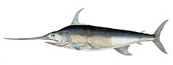

```{=html}
<style>
  .col2 {
    columns: 2 200px;         /* number of columns and width in pixels*/
    -webkit-columns: 2 200px; /* chrome, safari */
    -moz-columns: 2 200px;    /* firefox */
  }
  .col3 {
    columns: 3 100px;
    -webkit-columns: 3 100px;
    -moz-columns: 3 100px;
  }
  .col4 {
    columns: 4 100px;
    -webkit-columns: 4 100px;
    -moz-columns: 4 100px;
  }
</style>
```
```{r setup, include=FALSE}
library(dplyr)
library(pdftools)
library(SWOMSE)
library(DT)
knitr::opts_chunk$set(echo = FALSE)


```

## Introduction

Welcome to the North Atlantic Swordfish MSE homepage.

This site contains links to documents, reports, and presentations related to the management strategy evaluation (MSE) process for the North Atlantic Swordfish.

The MSE is being conducted with the open-source [openMSE](https://openmse.com/) framework. The code for the swordfish MSE is available in the `SWOMSE` R package available in the [ICCAT GitHub repository](https://github.com/ICCAT/nswo-mse).


## MSE Process Documentation

1. [Trial Specifications Doc](TS/Trial_Specs.html)

2. [CMP Development Guide](cMPdevelopment/CMP-Development-Guide.html)

3. [SWOMSE User Manual](UserManual/User_Manual.html)


## Operating Models

The 2022 stock assessment was used as a base case model for developing the Operating Models (OMs) for the MSE. Based on previous analyses, and a recent analysis involving applying the Francis iterative re-weighting procedure to the operating models, the OMs in the grid have been placed into two categories: Reference and Robustness OMs. See the [Trial Specifications Doc](TS/Trial_Specs.html) for more details on the development of the OM uncertainty grid. 

### Reference Operating Models

A set of 9 operating models have been identified as the main reference set. These operating models had the same structural and data assumptions as the 2022 Base Case assessment, with the exception that the natural mortality (*M*) and steepness (*h*) of the Beverton-Holt stock-recruitment relationship each spanned three levels of uncertainty:

1. *M* = 0.1, 0.2, and 0.3
2. *h* = 0.6, 0.75, and 0.9
 
### Robustness Operating Models 

#### R1. Higher Recruitment Variability

This set of 9 operating models had the same structure and assumptions as the Reference Set, with the exception that the recruitment variability was assumed to higher $(\sigma_R = 0.6)$.

#### R2. Removing Length Data 

This set of 9 operating models had the same structure and assumptions as the Reference Set, with the exception that the model was only fit to the indices of abundance (i.e., fits to the length composition data were not included in the total likelihood).

#### R3. Assumed Increase in Catchability

This set of 9 operating models had the same structure and assumptions as the Reference Set, with the exception that the indices of abundance were modified to assume an average 1% increase in catchability over the historical period. The Francis iterative re-weighting procedure has not yet been conducted for this operating models, and therefore these OMs have not yet been included in the MSE framework. 

#### Other Robustness Tests

Other robustness test, for example examining the impact of changing environmental conditions in the future projection period may be developed by the Group and will be briefly described here and documented in the [Trial Specifications Doc](TS/Trial_Specs.html).


### Individual OM Diagnostic Reports

The searchable table below displays the operating models in the `SWOMSE` package. The operating models can be accessed in the R package by the OM Object name, e.g., `SWOMSE::MOM_000` is the 2022 Base Case Stock Assessment.

Individual OM diagnostic reports can be accessed by clicking the links in the table below. 

```{r}
DF <- SWOMSE::OM_DF
DF$OM.name <- paste0('MOM_',DF$OM.num)
DF <- DF %>% select(OM.name, OM.num, M, sigmaR, steepness, `Include CAL`, llq, Class)

DF <- DF %>% mutate(across(3:8, as.factor))

# create links to OM diagnostic reports
fls <- list.files('Reports/OM_Diagnostics', pattern='.html')
num <- NA
for (x in seq_along(fls)) num[x] <- strsplit(fls[x], '-')[[1]][2]
nums <- as.numeric(num[1:(length(num))])
df <- data.frame(fl=fls, num=nums, stringsAsFactors = FALSE)
nums <- as.character(df$num)
nums[nchar(nums)==1] <- paste0('00', nums[nchar(nums)==1])
nums[nchar(nums)==2] <- paste0('0', nums[nchar(nums)==2])
df$OM.num <- nums

DF <-right_join(DF, df, by='OM.num')

OM.link <- paste0('<a href=', file.path('Reports/OM_Diagnostics', DF$fl), '> ', DF$OM.name , ' </a>')
DF$OM.name <- OM.link
DF$Class <- factor(DF$Class, levels=unique(DF$Class), ordered = TRUE)
rownames(DF) <- NULL
DF <- DF %>% select(OM.name, M, sigmaR, steepness, `Include CAL`, llq, Class)
DT::datatable(DF, escape=1,
              colnames=c('OM Object',
                         'M',
                         'sigmaR',
                         'Steepness (h)',
                         'Include CAL',
                         'Assumed historical increase in catchability',
                         'Class'),
              filter = 'top',
              options = list(
                pageLength = 10, 
                autoWidth = TRUE,
                sDom  = '<"top">lrt<"bottom">ip'))

```

### OM Summary Report

The overall [OM Summary Report](Reports/OM_Summary/2022/OM_Summary_Report.html) summarizes the diagnostic checks, the calculated biological reference points, and the estimated stock status relative to those reference points, for all operating models included in the OM Uncertainty Grid.  

## Related SCRS Papers

```{r, results='asis'}

get_metadata_paper <- function(pdf) {
  page1 <- pdf_data(pdf)[[1]]
  
  lst.head <- which(grepl('(1|2)\\d{3})', page1$text))
  if (!length(lst.head)) {
    lst.head <- 1
  }
  lst.head <-lst.head[1]
  if (lst.head>20) lst.head <- 1
  page1_nohead <- page1[(lst.head+1):nrow(page1),]
  
  ind <- which(grepl("^[[:upper:]]+$", page1_nohead$text))
  
  d <- diff(ind)
  ind <- ind[1:(min(which(d>1))-1)]
  ind <- c(ind, max(ind)+1)
  title <- paste0(page1_nohead$text[ind], collapse = ' ')
  
  scrs <- page1$text[1]
  year <- strsplit(scrs, '/')[[1]][2]
  title <- paste0(title,' (', scrs, ')')
  data.frame(title=title, year=year)
  
}


list.papers <- list.files('./SCRS_Papers/')
list.out <- list()
for (i in seq_along(list.papers)) {
  fl <- list.papers[i]
  link <- file.path('./SCRS_Papers/',fl)
  df <- get_metadata_paper(link)
  df$link <- link
  list.out[[i]] <- df
}
df <- do.call('rbind', list.out)

df <- df %>% dplyr::arrange(desc(year))

for (i in 1:nrow(df)) {
  if (i==1) {
    cat('#### ', df$year[i], '\n', sep="")
  } else {
    if (df$year[i]!=df$year[i-1])
      cat('\n#### ', df$year[i], '\n', sep="")
  }
  cat('\n 1. [', df$title[i], '](', df$link[i], ')', '\n', sep="")
  
}

```


## Meeting Reports


```{r message=FALSE, warning=FALSE, results='asis'}

get_title_report <- function(pdf) {
  page1 <- pdf_data(pdf)[[1]]
  page1_title <- page1 %>% filter(height >10) 
  begin_ab <- min(which(grepl('\\“', page1_title$text)))
  if (!is.finite(begin_ab))
    begin_ab <- nrow(page1_title)+1
  title <- page1_title$text[1:(begin_ab-1)]
  paste0(title, collapse = ' ')
}


list.reports <- list.files('./Meeting_Reports/')
list.out <- list()
for (i in seq_along(list.reports)) {
  fl <- list.reports[i]
  link <- file.path('./Meeting_Reports/',fl)
  title <- get_title_report(link)
  year <- strsplit(fl, "_")[[1]][1]
  list.out[[i]] <- data.frame(year=year,
                              title=title,
                              link=link)
}
df <- do.call('rbind', list.out)

df <- df %>% dplyr::arrange(desc(year))

for (i in 1:nrow(df)) {
  if (i==1) {
    cat('### ', df$year[i], '\n', sep="")
  } else {
    if (df$year[i]!=df$year[i-1])
      cat('\n### ', df$year[i], '\n', sep="")
  }
  cat('\n 1. [', df$title[i], '](', df$link[i], ')', '\n', sep="")
  
}

```


<br>
<br>
