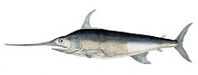

<style>
  .col2 {
    columns: 2 200px;         /* number of columns and width in pixels*/
    -webkit-columns: 2 200px; /* chrome, safari */
    -moz-columns: 2 200px;    /* firefox */
  }
  .col3 {
    columns: 3 100px;
    -webkit-columns: 3 100px;
    -moz-columns: 3 100px;
  }
  .col4 {
    columns: 4 100px;
    -webkit-columns: 4 100px;
    -moz-columns: 4 100px;
  }
</style>

```{r setup, include=FALSE}
library(dplyr)
knitr::opts_chunk$set(echo = FALSE)


```

## SWOMSE Documentation 
<div class="col2">

[Trial Specifications Doc](TS/Trial_Specs.html)

[CMP Development Guide (HTML)](cMPdevelopment/CMP-Development-Guide.html)

[CMP Development Guide (PDF)](cMPdevelopment/CMP-Development-Guide.pdf)


</div>


## Reports

### OM Summary Report

<div class="col2">

[SCRS/2021/099](Reports/OM_Summary/Hordyk_et_al_SCRS_2021_099.pdf)

[SCRS/2021/099 Appendix B](Reports/OM_Summary/SCRS_2021_090_Appendix_B.html)

</div>

### Index Fit Report
<div class="col2">

[Index Fit Report](Reports/Hordyk_SCRS_2021_100.pdf)

</div>


<!-- **Tables** -->
<!-- <div class="col2"> -->
<!-- ```{r, results='asis'} -->
<!-- csv.fls <- list.files('Reports/OM_Summary', pattern="csv") -->
<!-- for (fl in csv.fls) { -->
<!--   cat('[', fl, '](', paste0("Reports/OM_Summary/", fl), ')\n\n', sep="") -->
<!-- } -->
<!-- ``` -->
<!-- </div> -->


### Individual OM Diagnostic Reports
Individual OM diagnostic reports for the 216 Operating Models in the updated OM Uncertainty Grid:
<details>
<summary>Click to expand</summary>
<div class="col4">

```{r, include=FALSE}
fls <- list.files('Reports/OM_Diagnostics', pattern='.html')

num <- NA
for (x in seq_along(fls)) num[x] <- strsplit(fls[x], '-')[[1]][2]
nums <- as.numeric(num[1:(length(num))])
df <- data.frame(fl=fls, num=nums, stringsAsFactors = FALSE)
df <- df %>% dplyr::arrange(num)

```


```{r, results='asis'}
for (i in 1:nrow(df)) {
  nm <- strsplit(df[i,1], '.html')[[1]][1]
  fl <- paste0('Reports/OM_Diagnostics/', df[i,1])
  cat('\n[',nm,'](',fl,')\n', sep="")
}
```
</details> 
</div>
